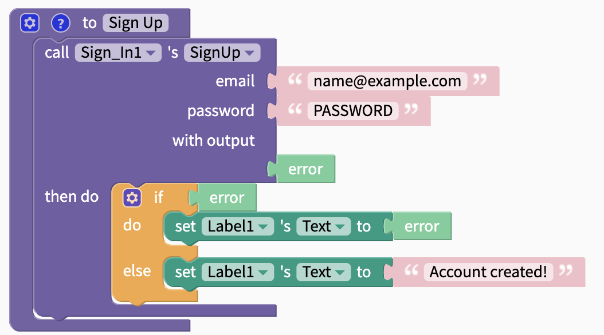
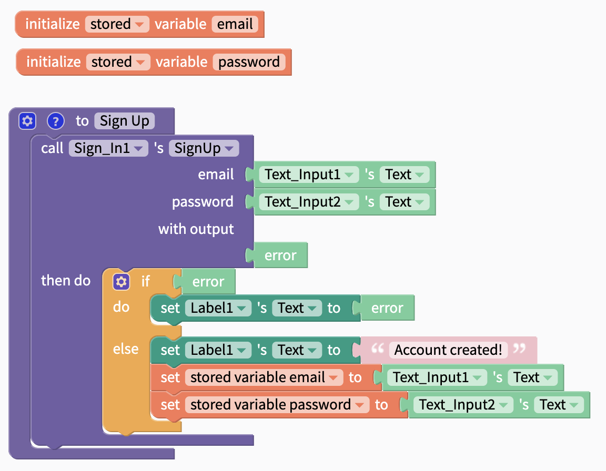
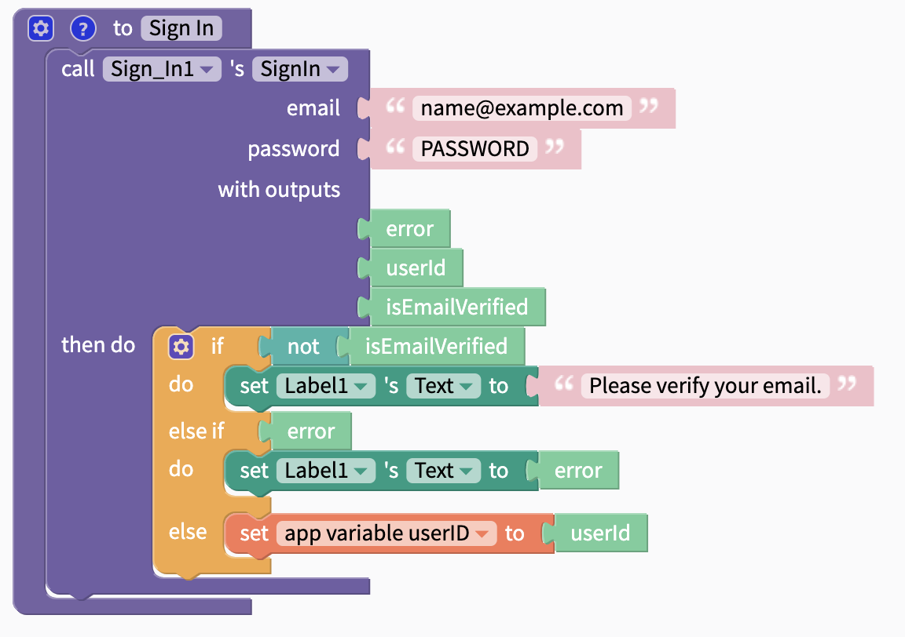
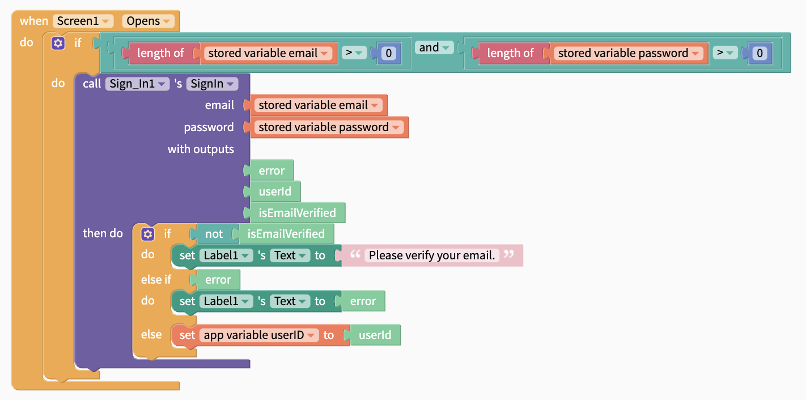
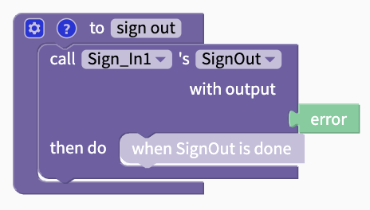
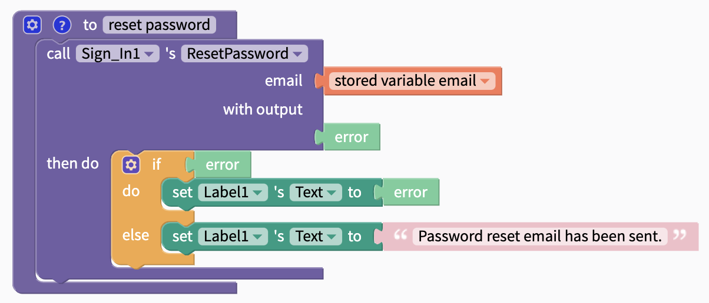

# Email Sign In by Firebase


To use Sign In, you will need to first create your own Firebase account and project


## Getting Started

### Create your free [Firebase](https://firebase.google.com/) account and create a new project

### Enable Email / Password Sign in

In the Firebase console, navigate to Authentication and the tab "Sign-In Method". Enable Email/Password as shown below.

### Connect your Firebase Account with Thunkable

There are two properties that you need to retrieve from Firebase to connect it with Thunkable which are both retrievable from the Firebase console: `API key` and `database URL`

`API key` and `database URL`

### \(Optional\) Modify the email template you send to verify your users' emails

## Using the Sign In Component in your App

Click on the Sign In drawer of blocks to access the Sign In blocks.

## Sign up

The first step for users is to Sign Up with their email address and a password. They will be sent an email to verify the address that they provided. 

| Event | Description |
| :--- | :--- |
| Sign up \( `email`, `password)`\) | Signs up a user for a new account. Returns an `error` if sign up is not successful. A common `error` is "The email address is already in use by another account." |

Here is an example of using this block:

## Sign in

This block will sign a user in and return their user ID.

| Name | Data Type | Data |
| :--- | :--- | :--- |
| error | Text | If error, returns error; else, returns `null` |
| userId | Text | Returns unique ID for each account |
| isEmailVerified | True/False | If email has been verified, returns `true`; else, returns `false` |

When the user's email and password have been stored locally, the following blocks can be used to sign the user in with these details automatically.

## Sign Out

Signs the user out.

## Reset Password

Send an email to the specified email address to reset their password

## Manage User Access

On the Firebase console, navigate to the Users tab under Authentication and you'll find a dashboard where you can reset a user's password, disable and delete their accounts.

