# Account Sign In


Some external setup is needed to add authentication to your app. See more details in the [Firebase](sign-in.md#firebase-blocks) and [Google Sign-In](sign-in.md#google-sign-in) sections of this document.


## Firebase Sign In

### Video Tutorial

You can watch a video to learn about the Firebase Sign In blocks here:



### Getting Started

Create your free [Firebase](https://firebase.google.com/) account and create a new project

#### Enable Email / Password Sign in

In the Firebase console, navigate to Authentication and go to the `Sign-in method` tab.

Find the `Email/Password` item under `Sign-in providers`.&#x20;

Click the pen icon to edit the configuration. Set the `Email/Password` property to true and save.

#### Connect your Firebase Account with Thunkable

There are two properties you need to retrieve from Firebase to connect it with Thunkable, `API key` and `database URL`. Both are retrievable from the Firebase console.

You can add these values to your Project Settings, which you can access by clicking on the gear icon to the left of the Design tab of your project.

To get these values from your Firebase project, click on the gear icon next to Project Overview and click `Project settings`.

In the General tab, scroll down to the section called Your Apps.\
You will find your API Key and Database URL in the code snippet provided.

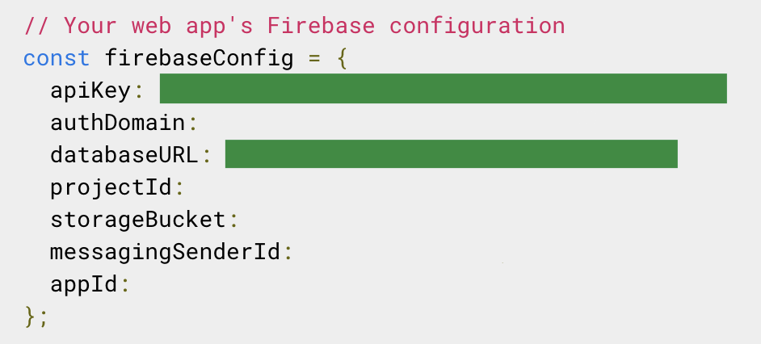

#### (Optional) Modify the email template you send to verify your users' emails

You can modify the default email that is sent to new users in the Templates tab of the Authentication segment of your console.

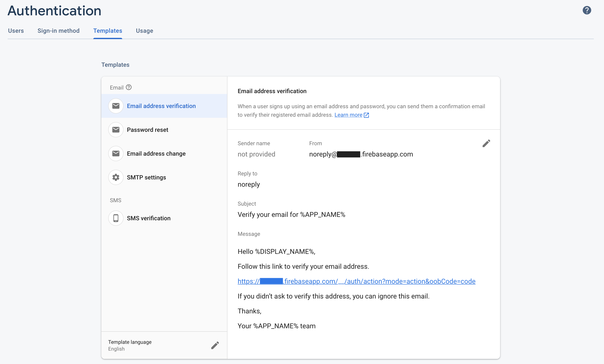

### Using the Sign In Component in your App

Click on the Sign In drawer of blocks to access the Sign In blocks.

.png>)

### Firebase sign up

The first step for users is to sign up with their email address and a password. They will be sent an email to verify the address that they provided.&#x20;

| Event                           | Description                                                                                                                                                       |
| ------------------------------- | ----------------------------------------------------------------------------------------------------------------------------------------------------------------- |
| Sign up ( `email`, `password)`) | Signs up a user for a new account. Returns an `error` if sign up is not successful. A common `error` is "The email address is already in use by another account." |

Here is an example of using this block:

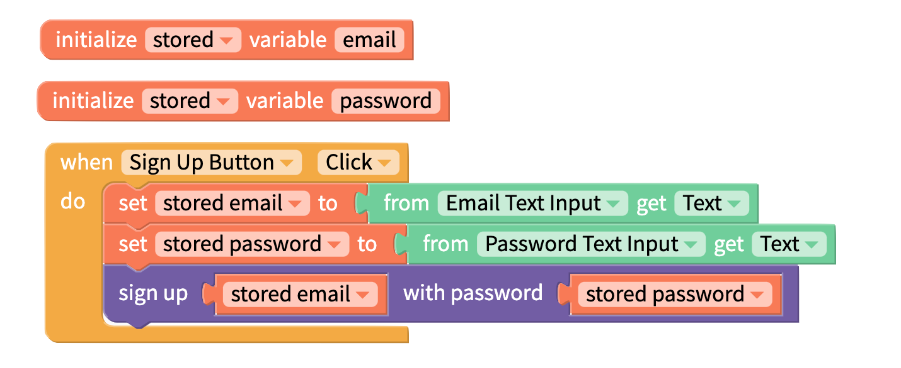

### Firebase sign in

This block will sign a user in and return their user ID.

You can use these blocks below to sign a user in:

When the user's email and password have been stored locally, the following blocks can be used to sign the user in with these details automatically.

You can also use the User ID as a key for storing user data in the cloud. See the [Cloud Variables video tutorial](variables.md#video-tutorials) for an example of this.

### Firebase sign out

Signs the user out.

### Firebase reset password

Sends an email to the specified email address to reset their password.

### Manage User Access

On the Firebase console, navigate to the Users tab under Authentication and you'll find a dashboard where you can reset a user's password, and disable and delete their accounts.

## Google Sign-In

### Getting started

This block allows end users of Thunkable-built apps to sign up and sign in to the app using their  existing Google account.&#x20;

To use this feature, you will need to obtain an **OAuth Client ID** and **iOS URL scheme** from Google:&#x20;

### Create or Select a project

#### **1. Go to** [**console.cloud.google.com**](https://console.cloud.google.com).&#x20;

If this is your first time visiting, you may need to log in, provide your location, and accept the Google Cloud Platform Terms of Service.

#### **2. Select an existing project or create a new one**&#x20;

Click "Select a project" from the dropdown on the top-left of the screen. \
Select a project or click the "NEW PROJECT" button at the top-right of the popup screen and create the project on the next screen.

<figure>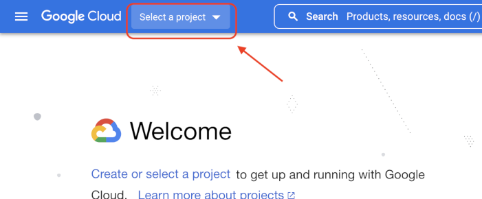<figcaption></figcaption></figure>

<figure>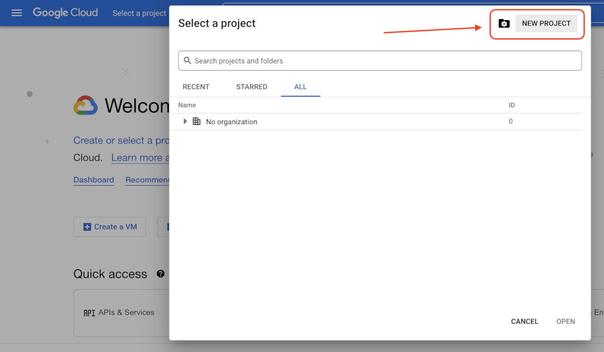<figcaption></figcaption></figure>

<figure>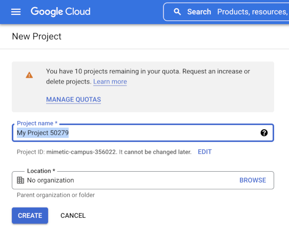<figcaption></figcaption></figure>

You will see a notification to the top-right of the screen once a new project is created.\
Click "SELECT PROJECT" to select this project.\
You can also select this project from the 'Select a project' dropdown menu as described above.

<figure>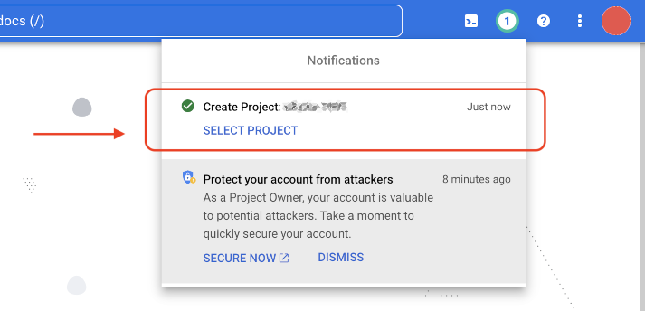<figcaption></figcaption></figure>

### Get OAuth Client ID

**1. Go to the OAuth consent screen.**&#x20;

In the side menu, expand "APIs & Services" and select "OAuth consent screen"

<figure>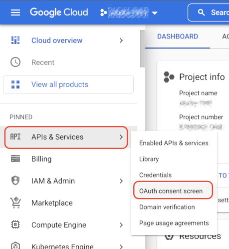<figcaption></figcaption></figure>

#### **2. Set up the consent screen.**&#x20;

On the OAuth consent screen, select the User Type and select "CREATE." \
(You probably want to select "External" unless you are creating an app specifically for users in the same organization as your Google Cloud account).

<figure><figcaption></figcaption></figure>

#### 3. **Complete the App Information form.**&#x20;

Make sure you complete the required fields, highlighted in red below. \
Click "SAVE AND CONTINUE" .

<figure><figcaption></figcaption></figure>

<figure>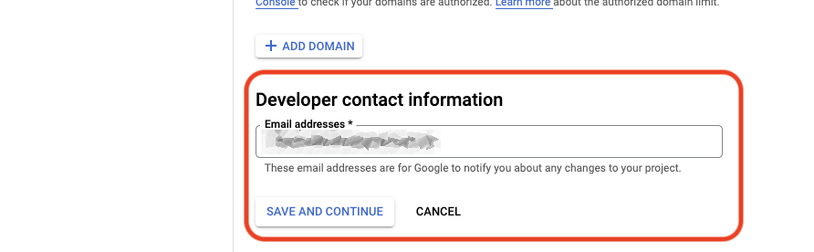<figcaption></figcaption></figure>

#### 4. Get project Scopes

You will then be taken to the "**Scopes**" step. \
Click on the "ADD OR REMOVE SCOPES" button at the top. \
This will open a panel on the right. \
Select the "**.../auth/userinfo.email**" and "**.../auth/userinfo.profile**" scopes.

<figure>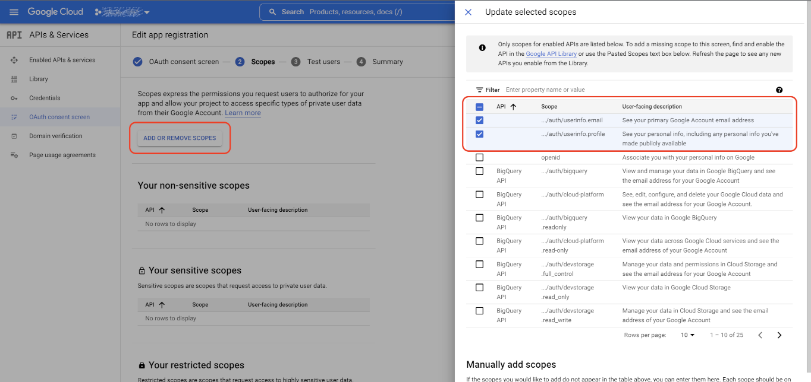<figcaption></figcaption></figure>

#### **5. Get your app credentials.**&#x20;

In the side menu, select "Credentials."&#x20;

<figure><figcaption></figcaption></figure>

On the Credentials screen, click the "CREATE CREDENTIALS" button at the top\
Select "OAuth client ID"

<figure><figcaption></figcaption></figure>

#### **6. Select credentials for the platforms you are building for.**&#x20;

Below are instructions for getting credentials for Android, iOS, and web projects. \
If you are implementing this feature on more than one platform, you will need to follow the instructions for each platform separately.

#### **7. Get credentials for Android.**&#x20;

Following step 5, select "Android" from the drop-down list. \
Fill in the required fields. \
For "Package name" you should use the App (Bundle) ID listed under "Publishing Settings" in your Thunkable project's Settings page.

<figure>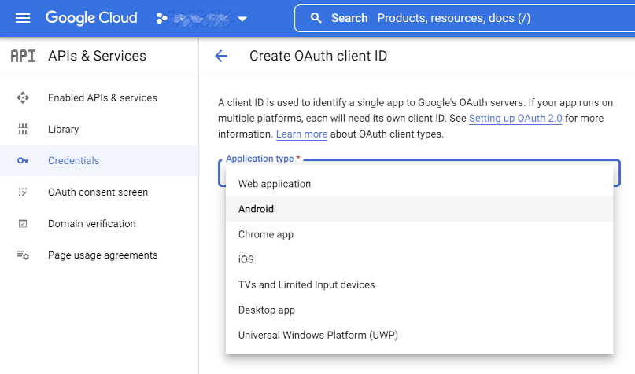<figcaption></figcaption></figure>

<figure><figcaption></figcaption></figure>

#### 7a. Get the SHA-1 Certificate fingerprint

For "SHA-1 certificate fingerprint" you will need to export your app's keystore and run a Java tool. To do so, you must complete the below sub-steps.

* **Download your Android app** (if you have never done so before for this app). \
  See instructions to download your Android app here: [Download Android app](https://docs.thunkable.com/download#download-android-app)\
  This will automatically generate a keystore for your Thunkable project \
  You do not need to download the resulting Android app file
* **Export your keystore**. \
  See instructions to export your keystore here: [Export Keystore from a Thunkable project](https://docs.thunkable.com/publish-to-play-store-android#exporting-importing-a-keystore-to-your-app)
*   **Run the keytool command**. \
    You will need to get the SHA-1 fingerprint for the keystore you just downloaded by using the **keytool command**. \
    To use this command, you will need to [download the Java Development Kit (JDK)](https://www.oracle.com/java/technologies/downloads/) for your system. \
    After installing the JDK, you may run the command from the Command Prompt (Windows) or Terminal (macOS): \
    **`keytool -keystore`` `**_**`path-to-debug-or-production-keystore`**_**` ``-list -v`**\
    where "_path-to-debug-or-production-keystore_" is the location of the keystore file on your computer. \
    If prompted for a password, enter the password you saved when exporting your keystore (see: [Alias and password](https://docs.thunkable.com/publish-to-play-store-android#alias-and-password))\
    Look for the "Certificate fingerprints" section. It may look something like:\
    \

    <figure>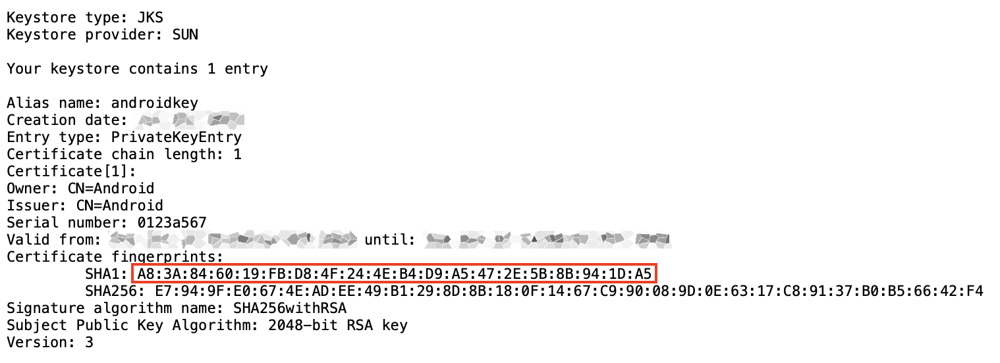<figcaption></figcaption></figure>

**8. Get credentials for iOS.** \
Following step 5, select "**iOS**" from the drop-down list. \
Fill in the required fields. \
For "Bundle ID" you should use the same App (Bundle) ID listed under "Publishing Settings" in your Thunkable project's Settings menu. \
Click "CREATE" at the bottom when completed. \
When the iOS OAuth 2.0 client ID becomes available, you may click on it to view your "Client ID" and "iOS URL scheme." \
Copy these into the "Google iOS Client ID" and "Google iOS URL Scheme" fields in your project settings.

**9. Get credentials for web.** \
Following step 5, select "**Web application**" from the drop-down list. \
Fill in the required fields and click the "ADD URI" button at the bottom. \
To test your project on the web, use "**`https://x.thunkable.com`**"\
To use Google sign-in with a published web app, use "**`https://thunkable.site/`**". \
Copy the resulting Client ID for this platform into the "Google Web Client ID" field of your project's Settings page.

### Get profile from Google

<figure>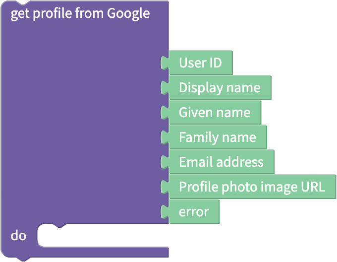<figcaption></figcaption></figure>

If an app end user is already signed in with Google, this block will return the following outputs \
If they are not logged in, the block will trigger a prompt to sign in with Google, after which a successful login will return the following:&#x20;

| Output Name             | Output Value                                                            | Data Type |
| ----------------------- | ----------------------------------------------------------------------- | --------- |
| User ID                 | Unique identifier for user's Google account                             | Text      |
| Display Name            | Full name associated with the Google account (eg. Mary Smith)           | Text      |
| Given Name              | Given name associated with the Google account (eg. Mary)                | Text      |
| Family Name             | Family name associated with the Google account (eg. Smith)              | Text      |
| Email address           | Email address of the Google account                                     | Text      |
| Profile photo image URL | URL that points to the profile image associated with the Google account | Text      |
| error                   | If there is an error, returns the error. Else returns `null`            | Text      |


For web apps, no blocks, including errors, will be returned if the user rejects login (as opposed to fails login).


