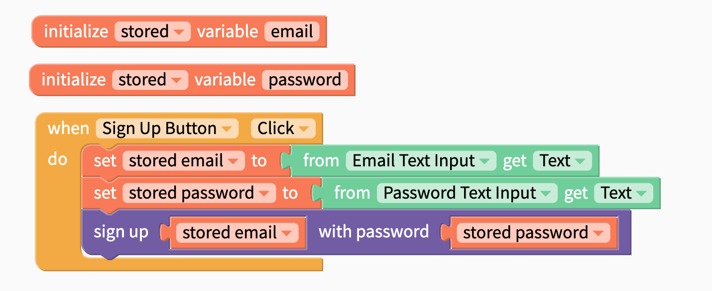
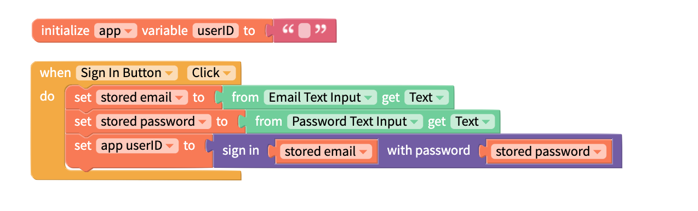
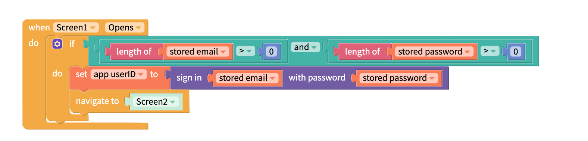
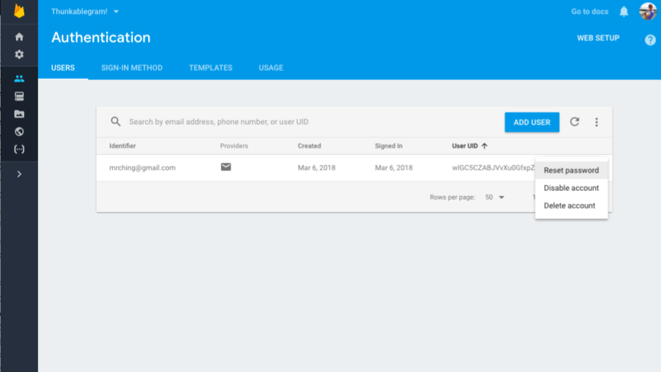

# Email Sign In by Firebase

* [Set up](sign-in.md#set-up)
* [Basic sign in](sign-in.md#basic-sign-in-)
* [Manage user access](sign-in.md#managing-user-access)


To use Sign In, you will need to first create your own Firebase account and project


## Video Tutorial

You can watch a video to learn about all of the Sign In blocks here:



## Getting Started

### Create your free [Firebase](https://firebase.google.com/) account and create a new project

### Enable Email / Password Sign in

In the Firebase console, navigate to Authentication and the tab "Sign-In Method". Enable Email/Password as shown below.

### Connect your Firebase Account with Thunkable

There are two properties that you need to retrieve from Firebase to connect it with Thunkable which are both retrievable from the Firebase console: `API key` and `database URL.` You can add these values to your Project Settings, which you can access by clicking on the gear icon to the left of the Design tab of your project.

### \(Optional\) Modify the email template you send to verify your users' emails

## Using the Sign In Component in your App

Click on the Sign In drawer of blocks to access the Sign In blocks.

## Sign up

The first step for users is to Sign Up with their email address and a password. They will be sent an email to verify the address that they provided. 

| Event | Description |
| :--- | :--- |
| Sign up \( `email`, `password)`\) | Signs up a user for a new account. Returns an `error` if sign up is not successful. A common `error` is "The email address is already in use by another account." |

Here is an example of using this block:

## Sign in

This block will sign a user in and return their user ID.

You can use these blocks below to sign a user in:

When the user's email and password have been stored locally, the following blocks can be used to sign the user in with these details automatically.

You can also use the User ID as a key for storing user data in the cloud. See the [Cloud Variables video tutorial](variables.md#video-tutorials) for an example of this.

## Sign Out

Signs the user out.

## Reset Password

Send an email to the specified email address to reset their password

## Manage User Access

On the Firebase console, navigate to the Users tab under Authentication and you'll find a dashboard where you can reset a user's password, disable and delete their accounts.

## See Also

Once you have signed a user in, you can use their user ID as a unique key to store unique user data to the cloud. See the [cloud variables video tutorial](variables.md#cloud-variables) for more information.  

