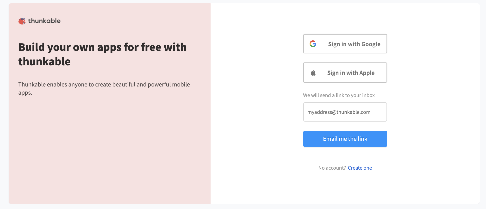

# Signing In

## **Sign Up**

To get started with Thunkable, visit our [sign up](https://x.thunkable.com/signup) page. 

You can sign up with a Google account or an Apple account and sign in immediately, or you can enter your email address and to be sent a magic sign-in link. 

We recommend using a Google or Apple account, as it will make testing your app a little easier.

If you choose to sign up with email, you will be sent an email like the image below. 

Pressing the **Click to Sign In** button will open your new Thunkable account and keep you signed in for 30 days, unless you choose to sign out sooner.

## **Sign in**‌

Returning users can go directly to our [sign in](https://x.thunkable.com/login) page to sign back into their Thunkable account. 

You can Sign in with Google, Sign in with Apple or Sign in with email.

### **Sign in with Google**

This button will sign you in automatically with your Google account. 

### Sign in with Apple

This button will sign you in automatically with your Apple account.‌

### **Sign in with Email**

If you click **Sign in with email** you will be invited to type your email address in a text input.

When you click **Email me the link** we will send you a link that will sign you back into your account.

## **Next Steps**

To learn more about using Thunkable, take a look at some of our [tutorials](tutorials.md).

Once you're ready to try out your app, we have a helpful guide for [live testing](live-test.md).

