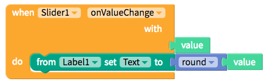

# Slider

The Slider is a great UI element to enable users easily select a value from a fixed range of values.

## Getting Started

To set up a slider, you'll have to first define the `minimum` and `maximum` values, the initial `value` and the incremental `steps` of the slider

We recommend using a Label with the Slider so that users can get immediate feedback on the value she or he is setting

| Property | Description |
| :--- | :--- |
| Minimum Value | Default \(`0`\); Minimum and leftmost value of the Slider |
| Maximum Value | Default \(`100`\); Maximum and rightmost value of the Slide |
| Value | Default \(`0`\); Initial value of the Slider |
| Step | Default \(`0`\); Increments of the Slider |

## Style the Slider

* **Minimum Track Tint Color:** Color of the slider track to the left of the thumb
* **Maximum Track Tint Color:** Color of the slider track to the right of the thumb
* **Thumb Tint Color \(Android only\):** Color of the thumb
* **Border:** 
  * **Width:** Enter how wide you want the border outline of the Slider to be
  * **Color:** Pick a color for the border of the Slider
  * **Style:** Select if you want the border to be a dotted, dashed or solid line
  * **Radius:** Enter how round you want the edges of the border for the Slider to be

| Property | Description |
| :--- | :--- |
| Minimum Track Tint Color | Default \(`none`\); Color of the slider track to the left of the thumb |
| Maximum Track Tint Color | Default \(`none`\); Color of the slider track to the right of the thumb |
| Thumb Tint Color \(Android only\) | Default \(`none`\); Color of the thumb |
| Border | Default \(`none`\); You can add a border with customized `width`, `color`, `style (solid, dotted, dashed)`and `borderRadius` |

### Edit the Slider size

You can set how tall the Slider is using the height property and set how wide it is using the width property.

**Height**

* **Fill container -** The Slider fills the entire screen vertically
* **Fit contents -** The Slider’s height changes to fit the contents it contains
* **Relative size -** The Slider fills the specified percentage of the screen
* **Absolute size -** Sizes the Slider to a specified number of pixels

**Width**

* **Fill container -** The Slider fills the entire screen horizontally
* **Fit contents -** The Slider’s width changes to fit the contents it contains
* **Relative size -** The Slider fills the specified percentage of the screen
* **Absolute -** Sizes the Slider to a specified number of pixels

## Add spacing

You change the spacing and positioning of the Slider with the Margin and Padding properties.

**Margin**

* You can specify how much space you want between the border and the contents of Slider using either pixel or percent values.

**Padding**

* You can specify how much space you want between the edges of the Slider and the screen using either pixel or percent values.

