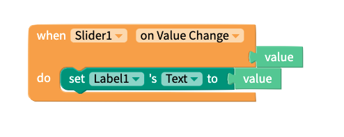
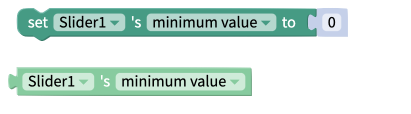
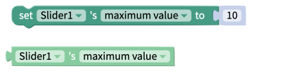
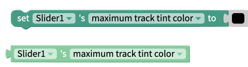
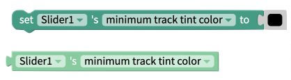

# Slider

## Slider Overview

The Slider is a great UI element to enable users easily select a value from a fixed range of values.

## Properties

### Slider

| Property | Description | Data Type |
| :--- | :--- | :--- |
| Minimum Value | Minimum value the user can select. Must be less than Maximum Value. | Number |
| Maximum Value | Maximum value the user can select. Must be greater than Minimum Value. | Number |
| Value | Initial value of the Slider | Number |
| Step | Step between values on the Slider | Number |
| Minimum Track Tint Color | Color of Slider track between minimum value and current value | Color |
| Maximum Track Tint Color | Color of Slider track between current value and maximum value | Color |
| Thumb Tint Color | Color of the Slider thumb widget | Color |
| Disabled | Toggle whether value Switch can be changed by user | True/False |

### Layout

| Property | Description | Data Type |
| :--- | :--- | :--- |
| X | Location of top left corner of Slider on X-axis, where the left hand side is X=0 | Number |
| Y | Location of top left corner of Slider on Y-axis, where the top side is Y=0 | Number |
| Height | Height of Slider in pixels | Number |
| Width | Width of Slider in pixels | Number |
| Visible | Set whether the Slider is visible | True/False |

### **Style**

| **Property** | Description | Data Type |
| :--- | :--- | :--- |
| Border Width | Width of border around Slider in pixels | Number |
| Border Radius | Radius of corners of border on Slider in degrees | Number |
| Border Color | Color of border \(only visible if border width &gt; 0\) | Color |
| Border Style | Set whether border style is solid, dotted or dashed  \(only visible if border width &gt; 0\) | Select from menu |

## Blocks

### Events 

#### On Value Change

Fires as the value of the slider changes. Returns the current value of the Slider.

#### On Sliding Complete

Fires when the user takes their thumb off the Slider. Returns the current value of the Slider.

### Properties

Set and get the [properties](slider.md#properties) of the Slider.

#### Minimum Value

#### Maximum Value

#### Value 

#### Step 

#### Get Computed Height 

Returns Height of the Slider in pixels as it appears on the screen.

#### Get Computed Width

Returns Width of the Slider in pixels as it appears on the screen.

#### Visible 

#### Maximum Track Tint Color

### 

#### Minimum Track Tint Color 

#### Disabled

#### Thumb Tint Color 

