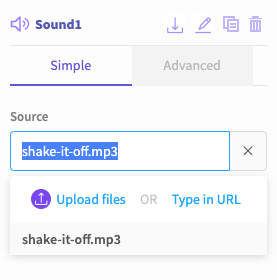
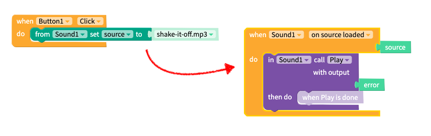

# Sound

* [Set Sound source](sound.md#set-sound-source)
* [Play a sound](sound.md#play-a-sound)

## Set Sound source

To play a sound, you need to upload it to the files section on Thunkable. You can also set the source of the sound component via the blocks. See how to do this in the [next section](sound.md#play-a-sound).

| Property | Description |
| :--- | :--- |
| Source | The name of the sound file e.g. `shake-it-off.mp3` or a link to the sound file; the Sound component accepts .mp3 and .wav files but does not accept .ogg files |
| Volume | Set how loudly the file should be played. Expects a value between 0 and 100 |

## Play a sound

Loading a sound happens asynchronously. This means that you need to wait some amount of time between changing the source file and the file being ready to play. The best practice for this component is to use the `on source loaded` block to call the `Play` function when the source file is ready to play. 

| Event / Property | Description |
| :--- | :--- |
| Play | Plays the sound |
| Pause | Pauses the sound |
| Resumes | Resumes playing the sound after a pause |
| Stop | Stops playing the sound |
| OnError | Triggers an event if there is an error playing the sound file |
| Volume | The volume of the sound |

