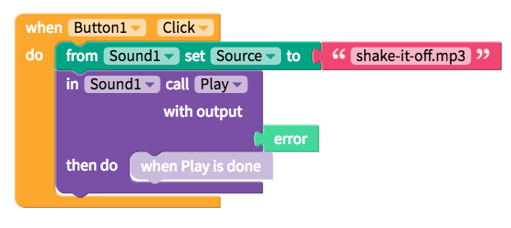

# Sound

* [Set Sound source](sound.md#set-sound-source)
* [Play a sound](sound.md#play-a-sound)

## Set Sound source

To play a sound, you need to upload it to the files section on Thunkable.

| Property | Description |
| :--- | :--- |
| Source | The name of the sound file e.g. `shake-it-off.mp3` or a link to the sound file; the Sound component accepts .mp3 and .wav files but does not accept .ogg files |

## Play a sound

| Event / Property | Description |
| :--- | :--- |
| Play | Plays the sound |
| Pause | Pauses the sound |
| Resumes | Resumes playing the sound after a pause |
| Stop | Stops playing the sound |
| OnError | Triggers an event if there is an error playing the sound file |
| Volume | The volume of the sound |

