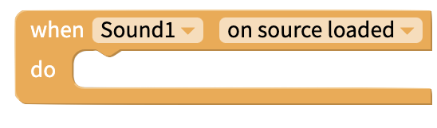
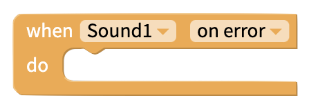
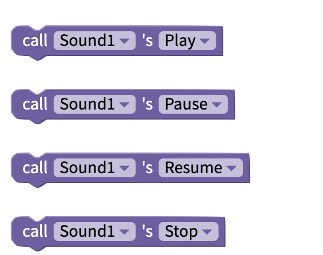
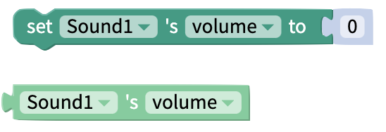

# Sound

## Set Source

There are a few ways you can set a sound source in your app:

1. **Upload a sound to your app.** Be careful of the Thunkable 50 MB [app size limit](projects/assets.md#app-size-limits-50-mb-per-app)
2. **Provide a link to the sound.** The link has to end in `.mp3`, `.wav`, etc

## Volume

You can set a volume for the Sound component between 0 and 100.

## Blocks

### Events

#### On Source Loaded

This block will be triggered when the source of a Sound component is loaded. It is recommended to use this block if changing a Sound component's source during app runtime.

#### On Error

This block will be triggered if there is an error with the Sound component.

### Functions

Play, Pause, Resume or Stop a sound.

A sound can only be resumed if it has been paused.

### Set/Get Source

Set the Sound's source using the drop-down menu or by using a [Text](text.md) block to specify a filename or URL.

Get the name of the Sound source.

### Set/Get Volume

Set Sound volume to value between 0 and 100.

Get Sound volume.

