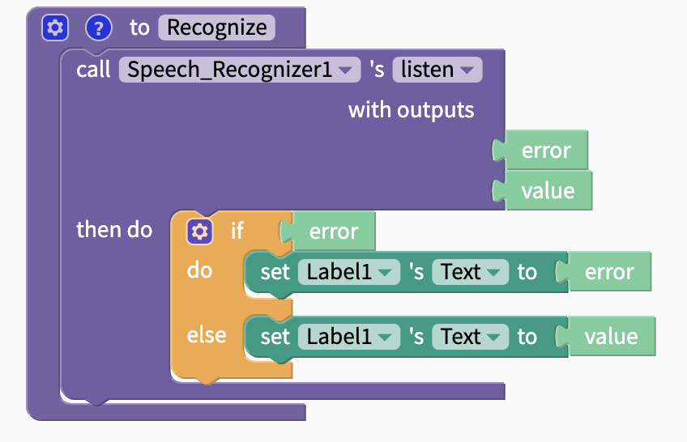
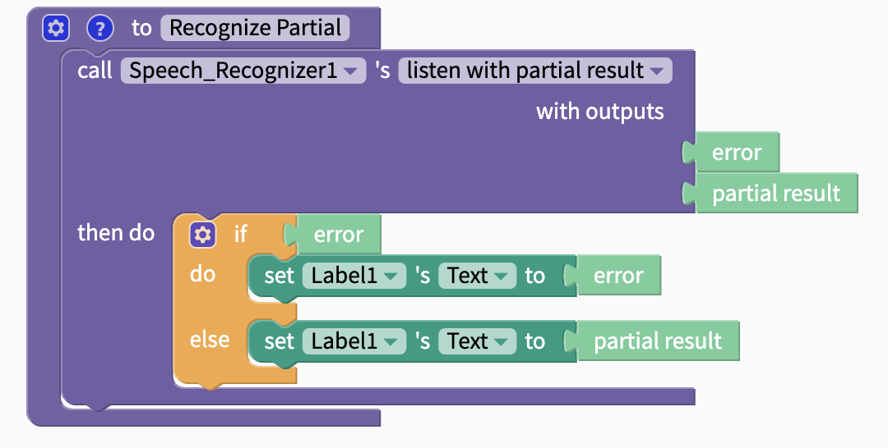
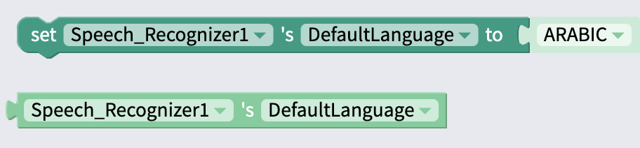

# Speech Recognizer

## Properties

`Default Language`: Set component to recognize text and speak in this language. Can be changed in blocks.

## Blocks

### Functions

#### Listen

Outputs

| Name | Data Type | Data |
| :--- | :--- | :--- |
| error | text | if error, returns error; else, returns `null` |
| value | text | text of speech that was recognized |

#### Listen with Partial Result

Outputs

| Name | Data Type | Data |
| :--- | :--- | :--- |
| error | text | if error, returns error; else, returns `null` |
| partial result | text | text of speech that was recognized |

### Properties

#### Set/Get Default Language

Set default language to item from drop-down menu. Can also use [Text](text.md) block or [variable](variables.md) to set language.

Get current language of Speech Recognizer component.

