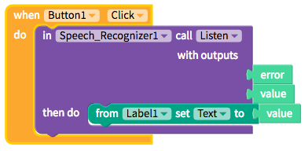
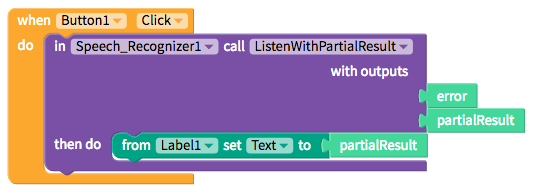

# Speech Recognizer

The Speech Recognizer component can translate a full phrase or in real-time as a person is speaking. The Speech Recognizer stops listening after it stops detecting any sound.

* [Translate a full phrase](speech-recognizer.md#recognize-a-full-phrase)
* [Translate in real-time](https://github.com/thunkable/thunkable-docs/tree/4a752596e288fca776105e94dc5e863bb9a3e25a/Recognize%20in%20real-time/README.md)

## Translate a Full Phrase

| Event | Description |
| :--- | :--- |
| Listen \(`speech`\) | Returns a text `value` after a full phrase has been spoken. The Speech Recognizer stops listening after it stops detecting any sound. |

## Translate in Real-time

| Event | Description |
| :--- | :--- |
| Listen with Partial Result  \(`speech`\) | Returns a text `partialResult` in real-time as a phrase is being spoken. The Speech Recognizer stops listening after it stops detecting any sound. |

## Languages Supported

At the moment there is only one property for the SpeechRecognizer. You can set the `DefaultLanguage` to be the language that your end user speaks. The following languages are supported:

* Arabic
* Chinese\_China
* Chinese\_HongKong
* Chinese\_Taiwan
* English
* Dutch
* English\_GB
* English\_US
* French
* German
* Hindi
* Italian
* Japanese
* Korean
* Portuguese
* Portuguese\_Brazil
* Russian
* Spanish
* Ukrainian

