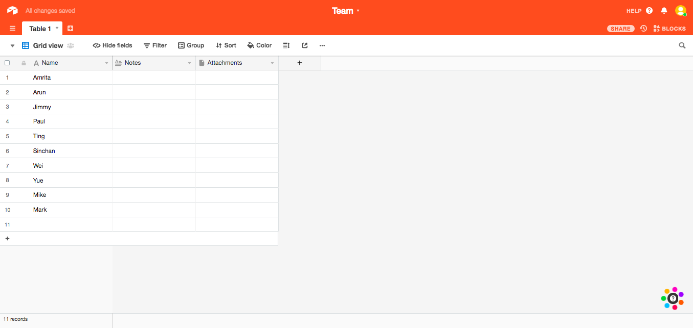
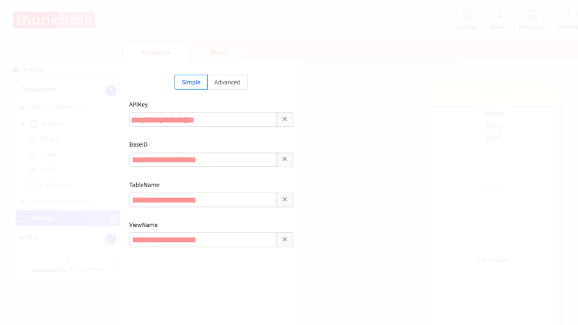
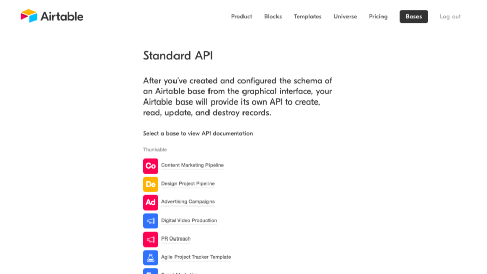
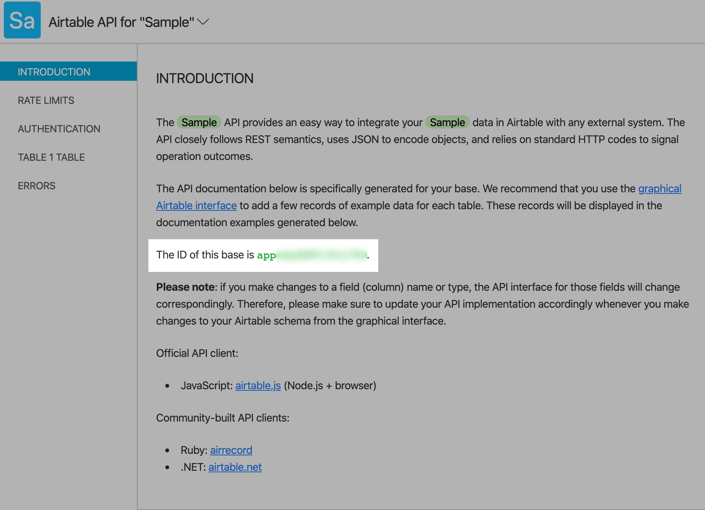
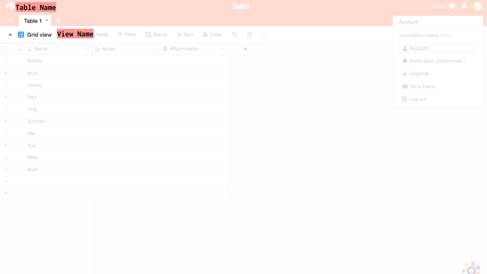
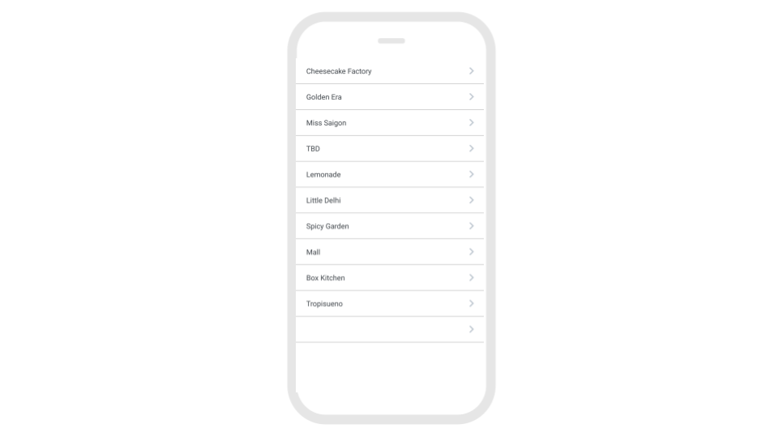
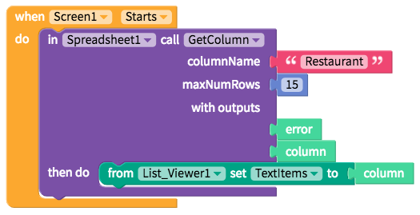
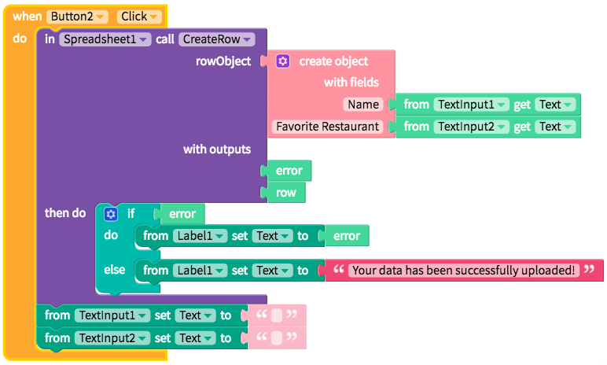

# Airtable

Airtable is a service that looks like a spreadsheet but actually acts like a database so it can do database-like things like store attachments i.e. images in your spreadsheets \(and not just text\) and link records between spreadsheets.

We like Airtable because set-up is relatively a breeze for a spreadsheet

* [Set up](spreadsheet.md#set-up)
* [Getting, uploading, updating and deleting data](spreadsheet.md#getting-uploading-updating-and-deleting-data-in-a-spreadsheet)

## Set up

### Create your [free Airtable](https://airtable.com/) base and account

### Connect your Airtable base with Thunkable

There are four properties that you need to retrieve from Airtable to connect it with Thunkable: `API key`, `Base ID`, `Table Name` and `View Name`

`API key`

To retrieve the API key, you'll have to navigate to the Account page and generate an API Key

`Base ID`

To retrieve the Base ID, navigate to the [Airtable API documentation](https://airtable.com/api) page and select your spreadsheet. You will see the Base ID in the 'Introduction' section of this page.

`Table Name` and `View Name`

The Table Name and View Name can be retrieved by grabbing the fields from your spreadsheet as shown below. Your default Table Name should be "Table 1". Your default View Name should be "Grid View".

## Getting, uploading, updating and deleting data

### Getting data

#### Getting items for a ListView from an Airtable column

| Event | Description |
| :--- | :--- |
| Get Cell \(`rowNum`, `columnName`\) | Returns the `value` of a specific cell |
| Get Column \(`columnName`, `maxNumRows`\) | Returns a `column` as a list |
| Get Row \(`rowNum`\) | Returns a row  `value` as an object |
| Get All Rows | Returns `rows` as an object |
| Get Selected Rows \(`startingRowNumber`, `numRows`\) | Returns `rows` as an object based on a specified `startingRowNumber` and `numRows` |

### Uploading and updating data

| Event | Description |
| :--- | :--- |
| Create Row \(`rowObject`\) | Uploads a new row of data based on a `rowObject` |
| Set Cell \(`rowNum`,`columnName`,`value`\) | Updates the `value`of a cell in a particular `rowNum` and `columnName` |
| Update Row \(`rowObject`\) | Updates a row based on a `rowObject` |
| Update Row Num \(`rowNum`, `rowObject`\) | Updates a row based on a `rowObject` and a `rowNum` |
| Replace Row Num \(`rowObject`\) | Replaces a row based on a `rowObject` |
| Replace Row \(`rowNum`, `rowObject`\) | Replaces a row based on a `rowObject` and a `rowNum` |

### Deleting data

| Event | Description |
| :--- | :--- |
| Delete Row Num \(`rowNum`\) | Deletes a row based on `rowNum` |
| Delete Row \(`rowNum`, `rowObject`\) | Deletes a row based on a `rowObject` and a `rowNum` |

