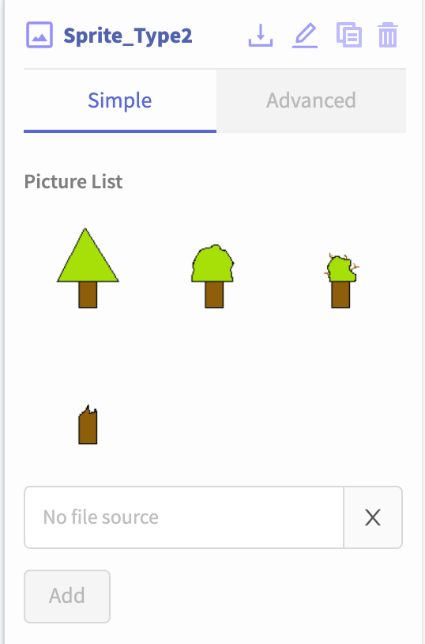
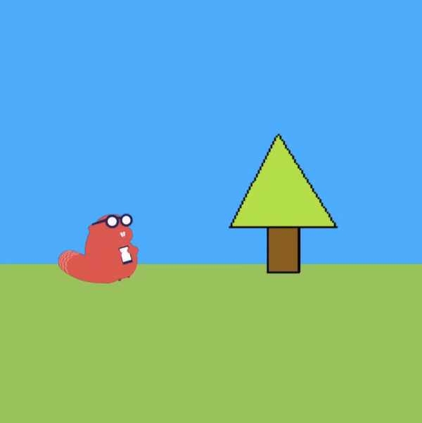
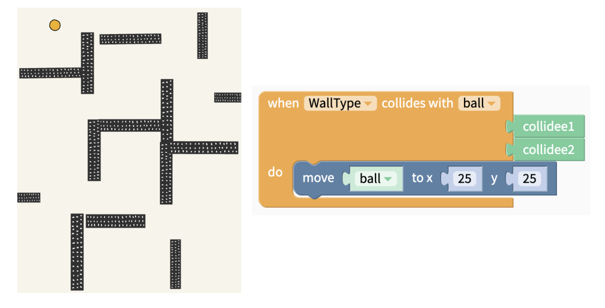

# Sprites

Sprites are images that can be placed on the Stage in the Canvas.   
They can react to being touched or dragged across the screen, or colliding with other sprites or the edge of the screen.

* [Sprites vs Sprite Types](sprites.md#sprites-vs-sprite-types)
* [Adding Sprite Types to your app](sprites.md#adding-sprites-types-to-your-app)
* [Adding Sprites to your app](sprites.md#adding-sprites-to-your-app)
* [Sprite Type Properties](sprites.md#sprite-type-properties)
* [Sprite Properties](sprites.md#sprite-properties)
* [Example: Different Types of Sprites](sprites.md#example-different-types-of-sprites)

## Sprites vs Sprite Types

A **Sprite Type** is a **category** of Sprites that you can add to your app. For example, in a video game you might have a Main Character Sprite Type and Obstacle Sprite Types. 

A **Sprite** is a **single instance** of a Sprite Type. In the video game example, you could have a single Obstacle Sprite Type, but multiple Obstacle Sprites in your app. They would be multiple Sprites of the same Sprite Type.

## Adding Sprites Types to your app

To add a Sprite Type to your app, click on the Stage of your Canvas. This will automatically bring you to the Canvas tab. Underneath your component tree, where you would see a component menu in the Design tab, you will see your Sprite Type menu.

You can click on 'Add Sprite Type' to add a new Sprite Type to your app.

## Adding Sprites to your app

Just like the components menu in the Design tab, you can click and drag Sprites from their Sprite Type category into your app.

In the below GIF, there is a canvas with a Sprite, called Sprite1. There is also a Sprite Type in the Sprite Type menu called Sprite\_Type1. When a Sprite is dragged from Sprite\_Type1 and dropped onto the Canvas, we see a new Sprite, called Sprite\_2.

## Sprite Type Properties

**Picture List:** You can upload multiple images to a Sprite Type's **Picture List**. This allows you to change the appearance of the sprite when some event happens.

In the GIF below, we see that when one Sprite \(the Thunkable Beaver\) collides with another Sprite \(the tree trunk\), the appearance of the Tree Sprite changes.

**Angle:** Change the angle of the sprite. The angle is measured in a clockwise direction and is measured in degrees, eg. setting angle to 30 will rotate your sprite 30 degrees clockwise.

**Opacity:** Change the opacity of the Sprite.

**Bounce:** When a sprite hits a surface or another sprite, this is the percentage of the speed that sprite with bounce back with. A bounce of 100 means that the sprite will bounce back at the same speed it had in its collision. A bounce of 200 will cause the sprite to bounce off with twice its speed. This is demonstrated in the GIF above under Picture List, where the beaver has a bounce of 50, or half its initial speed.

**Is Draggable:** When true, the player can drag the sprite

**Passes Through:** When true, all sprites will pass under or above the sprite. When false, the sprites will collide using the physics engine. This is demonstrated in the GIF above under Picture List.

**Is Static:** When a sprite is static, it acts like a wall. No forces can move it.

**Ignore Gravity:** Toggle whether of not the sprite is affected by the Stage's gravity. You can read more about the Stage's gravity properties [here](canvas.md#gravity).

**FixedRotation:** When fixed rotation is false, the sprite can rotate in any direction. When fixed rotation is true, the sprite will remain at its current angle.

**Drawing:** Toggle whether the sprite will draw a line when it is dragged around the Screen. You can set the **Drawing Color** and **Drawing Width** of the line that is drawn.

## Sprite Properties

**Angle, Opacity, Bounce, Is Draggable, Passes Through, Is Static, Ignore Gravity, Fixed Rotation,** and **Drawing** are all Sprite Type properties as well as Sprite properties. These are described in the previous section.  

**Picture Selection:** Select an image from the Picture List defined in the Sprite Type to display on the Sprite.

**X, Y:** Location of the top left pixel of the Sprite on the X-axis and Y-axis of the Stage. You can also click and drag the Sprite to your desired initial position.

**Z:** Where the Sprite is in the **Depth** of the Canvas. A Sprite with a higher Z-value will appear in front of a Sprite with a lower Z-value. This is demonstrated in the GIF above under the 'Picture List' section of Sprite Type Properties: the beaver has a higher Z-value than the tree, so it is in front when it passes the tree.

## Example: Different Types of Sprites

Groups of sprites that have the same behavior should belong to the same sprite type. In the example below, WallType is a Sprite Type, and there are multiple Sprites of this type in the app \(ie. the walls\). 

Whenever the ball touches any of the WallType Sprites, the ball goes back to its starting location.

