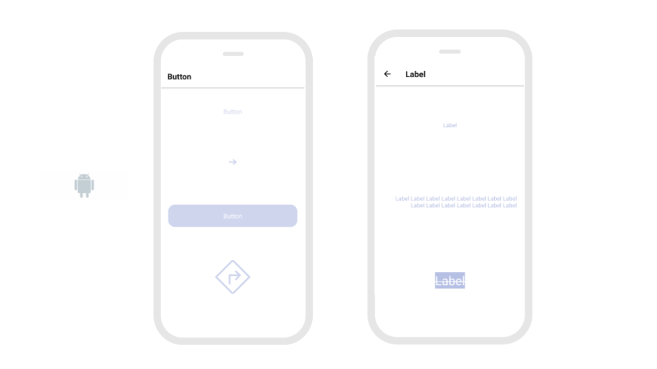
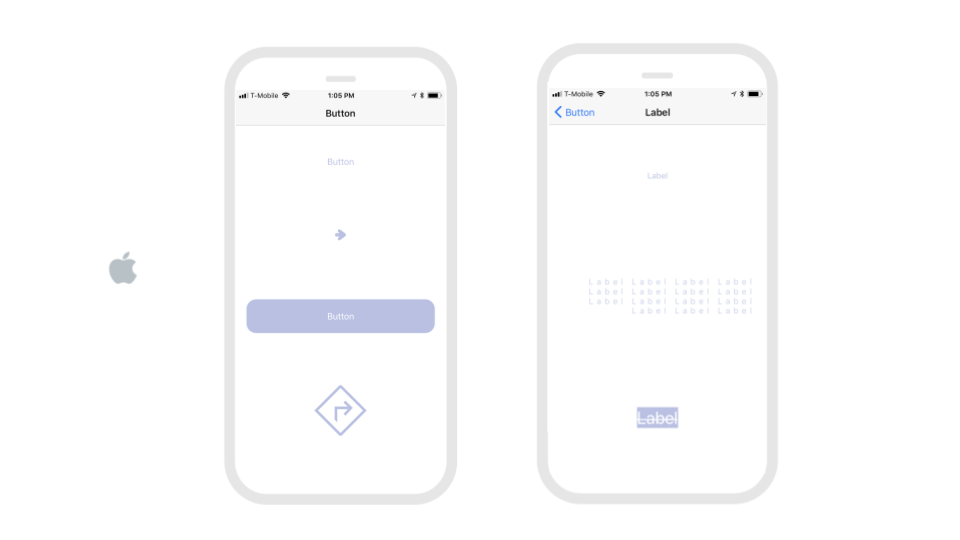
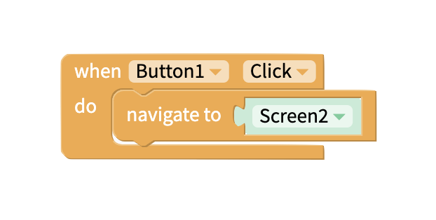

# Stack Navigator

## Stack Navigator Properties

### Set Your Screen Transitions

To enable a Stack transition, you will have to add a Screen navigation block like the one below. You can find the Screen navigation block in the pre-built Control category:

Screens can Stack from left to right or from top to bottom. You can set the transition style with the Stack property below:

| Property | Description |
| :--- | :--- |
| Mode | Default \(`card`\); `Card` mode stacks screens from left to right while `modal` stacks screens from top to bottom |


It is not possible to use blocks to navigate from a screen **outside** of your Stack Navigator to a screen **inside** your Stack Navigator


### Hide Your Header

It is possible to hide the Header bar and maintain the Stacking transition by using the Stack property below. Hiding the Header bar will also hide the back button that makes it easier to transition to your original screen

| Property | Description |
| :--- | :--- |
| Header Mode | Default \(`Screen`\); If you want to hide the header, set to `none` |

