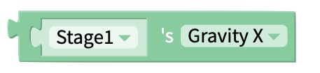
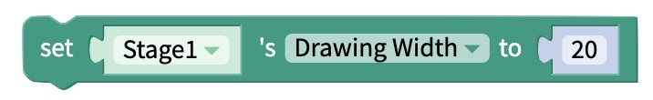

# Stage

## Current Stage

Select which Stage to display in the Canvas.

## Stage Appearance

### Set Background Color 

Sets the background color of the specified Stage.

### Get Background Color 

Returns the hexadecimal value of the background color for the specified Stage.

### Set Frame Color 

Sets the color of the Frame for the specified Stage.

### Get Frame Color 

Returns the hexadecimal value of the Frame Color for the specified Stage.

### Set Image Number to 

Set the background image of the stage to the specified item in the list.

## Stage Gravity 

Please refer to the [Canvas docs](https://docs.thunkable.com/canvas#gravity) to see some animated examples of the gravity properties.

### Set Y Gravity 

Sets the Stage gravity in the vertical direction.

### Get Y Gravity 

Returns the value of the Stage gravity, in the vertical direction. 

### Set X Gravity

Sets the Stage gravity in the horizontal direction.

### Get X Gravity

Returns the value of the Stage Gravity, in the horizontal direction. 

## Drawing

### Set Touch Drawing 

Enable drawing on the stage if set to `true`. 

Disable drawing on the stage if set to `false`.

### Get Touch Drawing 

Return true or false, depending on whether or not drawing is enabled on the Stage. 

### Set Drawing Color 

Set the Drawing Color, or Line Color, for the stage.

### Get Drawing Color 

Returns the hexadecimal value of the Drawing Color for the specified Stage.

### Set Drawing Width 

Set the Drawing Width, or Line Width, for the stage.

### Get Drawing Width

Returns the numeric value for line width on the Stage.

