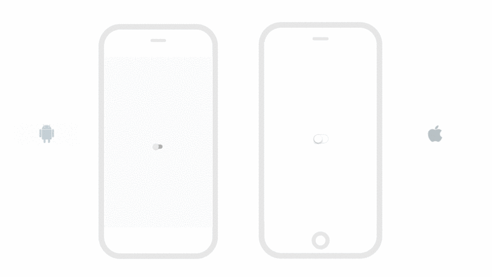
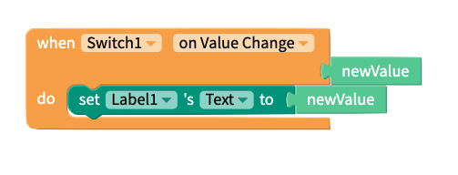
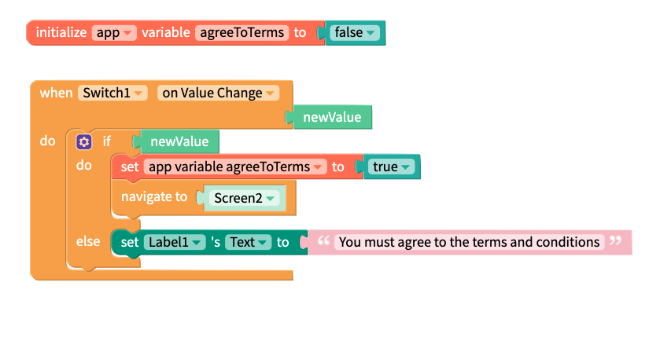
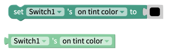
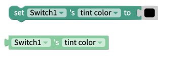
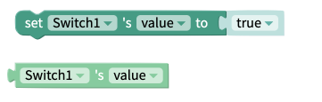
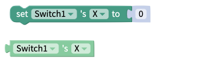
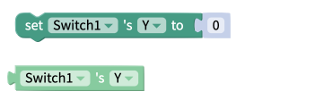

# Switch

A switch is a component that has two settings, true and false. You can get your app to do specific tasks only if the switch is set to true. 

* [Getting Started](switch.md#getting-started)
* [Style the Switch](switch.md#style-the-switch)
* [Events](switch.md#events)
* [Properties](switch.md#properties)

## Getting Started

Each time the switch is clicked the value will change. The value returned will only ever be `true` or `false`. To test this for yourself you can use the following blocks.

In the following example, the user can only advance to `Screen2` if the acknowledge they have accepted the terms and conditions by clicking on the switch.

| Event | Description |
| :--- | :--- |
| On Value Change | By default, the switch `newValue` will be set to `false`. If turned on, the `newValue` will be set to `true` |
| Value | If on, value is set to `true`; if off, `false` |
| Disabled | If set to `true`, switch will be disabled |

## Style the Switch

You can customize the switch with the following properties:

* **Tint Color:** Color of the switch track when switch is set to off
* **On Tint Color:** Color of the switch track when switch set to on 
* **Thumb Tint Color:** Color of the switch thumb

## Events 

### On Value Change

This event fires every time the switch is clicked.

## Properties

### Disabled 

The disabled property is used to set whether or not the button is "clickable". Expected values for this property are:

* True
* False

### Height 

The set and get height blocks work with the Height property of the switch component.

### On Tint Color 

Change the "active" color of the switch.

### Thumb Tint Color 

Change the color of the switch

### Tint Color 

Change the "inactive" color of the switch

### Value 

Change the state \(on or off\) of the switch

### Visible 

Show or hide the switch on the screen.

### Width 

The set and get height blocks work with the Width property of the switch component.

### X 

### Y

