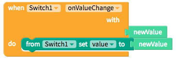
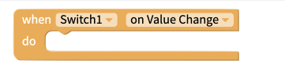

# Switch

A switch is a component that has two settings, true and false. You can get your app to do specific tasks only if the switch is set to true. 

* [Set up](switch.md#set-up)
* [Style the Switch](switch.md#style-the-switch)

## Getting Started

To enable the Switch, you'll have to use the block below to set the Switch `value` to the `newValue` when you turn on and off the switch.

| Event | Description |
| :--- | :--- |
| On Value Change | By default, the switch `newValue` will be set to `false`. If turned on, the `newValue` will be set to `true` |
| Value | If on, value is set to `true`; if off, `false` |
| Disabled | If set to `true`, switch will be disabled |

## Style the Switch

You can customize the switch with the following properties:

* **Tint Color:** Color of the switch track when switch is set to off
* **On Tint Color:** Color of the switch track when switch set to on 
* **Thumb Tint Color:** Color of the switch thumb

## Events 

### On Value Change

## Properties

### Disabled 

### Height 

### On Tint Color 

### Thumb Tint Color 

### Tint Color 

### Value 

### Visible 

### Width 

### X 

### Y

