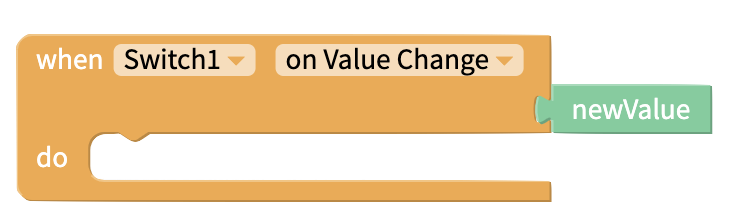

# Switch

## Switch Overview​ 

A switch is a component that has two settings, true and false. You can get your app to do specific tasks based on the value of the switch.

## Properties 

### Switch

| Name | Description | Data Type |
| :--- | :--- | :--- |
| Value | Initial value of Switch | True/False |
| Tint Color | Color of background when Switch is **false** | Color |
| On Tint Color | Color of background when Switch is **true** | Color |
| Thumb Tint Color | Color of thumbpad of Switch | Color |
| Disabled | Toggle whether value Switch can be changed by user | True/False |

### Layout

| Property | Description | Data Type |
| :--- | :--- | :--- |
| X | Location of top left corner of Switch on X-axis, where the left hand side is X=0 | Number |
| Y | Location of top left corner of Switch on Y-axis, where the top side is Y=0 | Number |
| Height | Height of Switch in pixels | Number |
| Width | Width of Switch in pixels | Number |
| Visible | Set whether the Switch is visible | True/False |

## Blocks 

### Events 

#### On Value Change

This event fires every time the switch is clicked.

Returns `newValue` output block, which returns the new value of the Switch \(`true` or `false`\).

### Properties

Use these blocks to set and get the named [properties](switch.md#getting-started) of the Switch.

#### Value 

#### Tint Color 

#### On Tint Color 

#### Thumb Tint Color 

#### Disabled 

#### X 

#### Y

#### Height 

#### Width 

#### 

#### Visible 

