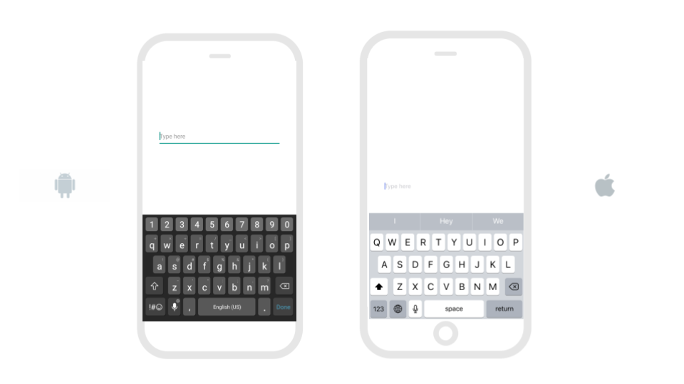
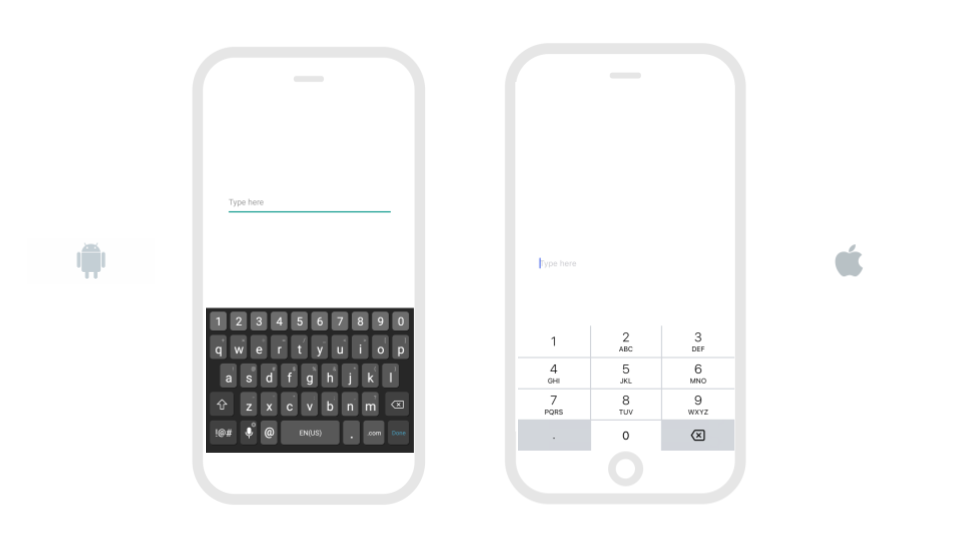
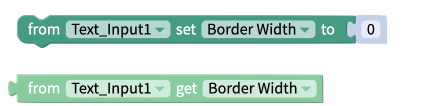
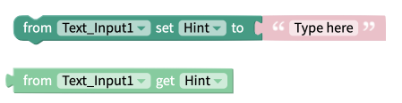
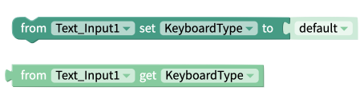
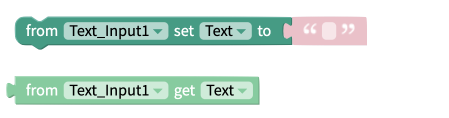
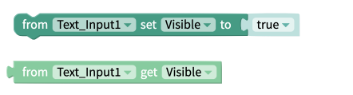
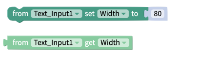

# Text Input

* [Set keyboard type](text-input.md#set-keyboard-type)
* [Set up for passwords](text-input.md#set-up-for-passwords)
* [Style the Text Input](text-input.md#style-the-text-input)
* [Edit the Text Input size](text-input.md#edit-the-text-input-size)
* [Add spacing](text-input.md#add-spacing)
* [Event Blocks](text-input.md#events)
* [Property Blocks](text-input.md#properties)

## Set Keyboard type

You can choose from the following types of keyboards:

* **Default keyboard:** Displays your device’s default keyboard
* **Email Address:** Displays an alphanumeric keyboard to accept email addresses
* **Numeric:** Displays a keypad with only numbers; It is similar to the phone pad keyboard
* **Phone Pad:** Displays a telephone keypad; It is similar to the numeric keyboard

## Set up for Passwords

You can also set up Text Input for passwords as shown below using the Secure Text Entry Switch. This switch will replace text with \* as users type.

To activate Secure Text Entry, click on the advanced properties tab for the text input component. Scroll down to the Secure Text Entry section and set the switch to true.

## Style the Text Input

You can customize the Text Input component with the following properties: 

* **Hint:** Hint text that disappears when the user starts typing into the Text Input
* **Text:** Text that appears on the text input 
* **Visible:** To see the text input in your app, set the switch to true
* **Border**
  * **Width:** Enter how wide you want the border outline of the text input to be
  * **Color:** Pick a color for the border of the text input
  * **Style:** Select if you want the border to be a dotted, dashed or solid line
  * **Radius:** Enter how round you want the edges of the border for the text input to be

## Edit the Text Input size

You can set how tall the text input is using the Height property and set how wide the text input is using the Width property.

**Height**

* **Fill container -** The text input fills the entire screen vertically
* **Fit contents \(Recommended\) -** The text input’s height changes to fit the contents it contains
* **Relative size -** The text input fills the specified percentage of the screen
* **Absolute size -** Sizes the text input to a specified number of pixels

**Width**

* **Fill container -** The text input fills the entire screen horizontally
* **Fit contents -** The text input’s width changes to fit the contents it contains
* **Relative size -** The text input fills the specified percentage of the screen
* **Absolute -** Sizes the text input to a specified number of pixels

## Add spacing

You change the spacing and positioning of the text input with the Margin and Padding properties.   
  
**Margin**

* You can specify how much space you want between the edges of the text input and the screen using either pixel or percent values.

**Padding**

* You can specify how much space you want between the border and the contents of the text input using either pixel or percent values.

## Events

### Click

This event fires when the user clicks on the Text Input component.

## Properties

### Border Width

The border width value corresponds to the size of the border around the Text Input. Changes to the color and style of the border must be done in the[ designer.](text-input.md#style-the-text-input) 

### Computed Dimensions 

The `Computed Height` and `Computed Width` blocks return the on-screen dimensions of the Text Input, after it has been rendered on the device screen. The value returned is an integer, representing the size of the component, in pixels.

### Height 

The set and get height blocks work with the Height property of the Text Input component. Acceptable input values are. 

* Number of Pixels
* Percentage Height
* "Fit Contents"
* "Fill Container"

### Hint 

The set and get hint work with the prompt that is displayed in the Text Input, before the user starts typing. Any string of text or number can be used as the hint.

### Keyboard Type 

The set and get keyboard type property gives you control over what version of the keyboard is displayed on-screen when the user starts typing. Acceptable values are:  

* default
* email address
* numeric
* phone pad

### Text 

The set and get text property works with the string of text that displayed in the Text Input. 

### Visible 

The set and get visible blocks are used to show or hide the entire Text Input component. Acceptable values are:

* True
* False

### Width

The set and get width blocks work with the Width property of the Text Input component. Acceptable values are.‌

* Number of Pixels
* Percentage Width
* "Fit Contents"
* "Fill Container"

