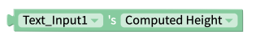
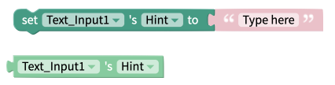

# Text Input

## Text Input Overview

## Properties

### Text Input

| Property          | Description                                                                                                              | Data Type                                                       |
| ----------------- | ------------------------------------------------------------------------------------------------------------------------ | --------------------------------------------------------------- |
| Hint              |  The prompt text the user sees when the Text Input is empty (eg. `Type Here`)                                            | Text                                                            |
| Text              | Text value of the Text Input                                                                                             | Text                                                            |
| Keyboard Type     | Set a keyboard to sppear when your end user clicks the Text Input                                                        | Select from list `[default, email address, numeric, phone pad]` |
| Secure Text Entry | Toggle whether text is obscured as your end user types (suitable for entering passwords and other sensitive information) | True/False                                                      |

### Advanced Properties

| Property                                 | Description                                                                            | Data Type                                                                  |
| ---------------------------------------- | -------------------------------------------------------------------------------------- | -------------------------------------------------------------------------- |
| Color                                    | Color of Text Input's Text                                                             | Color                                                                      |
| Background Color                         | Color of Text Input's background                                                       | Color                                                                      |
| Hint Text Color                          | Color of Text Input's hint                                                             | Color                                                                      |
| Font Family                              | Name of Font Family (options can be found at [Google Fonts](https://fonts.google.com)) | Text                                                                       |
| Font Style (Web Only)                    | Select whether font is shown in _italics_                                              | Select from list `[normal, italic]`                                        |
| Font Size                                | Height of Text in pixels                                                               | Number                                                                     |
| Letter Spacing                           | Spacing between letters in pixels                                                      | Number                                                                     |
| Text Decoration Line (Web only)          | Set whether text has ~~strikethrough~~ or underline                                    | Select from list `[none, underline, line-through, underline line-through]` |
| Text Decoration Style (Web only)         | Set style of Text Decoration Line                                                      | Select from list `[solid, dotted, double, dashed]`                         |
| Text Decoration Color (iOS and Web only) | Set color of Text Decoration Line                                                      | Color                                                                      |
| Writing Direction (iOS and Web only)     | Set whether text should be written left-to-right or right-to-left                      | Select from list `[auto, ltr, rtl]`                                        |
| Editable                                 | Toggle whether your end user can edit the text                                         | True/False                                                                 |
| Multiline                                | Toggle whether your end user can enter multiple lines of text                          | True/False                                                                 |
| Auto Focus                               | Toggle whether Text Input is automatically in focus when the Screen opens              | True/False                                                                 |
| Max Length (Android and iOS only)        | Set maximum number of lines of text your end user can enter                            | Number                                                                     |
| Clear Button Mode (iOS only)             | Toggle when your iOS end users have the option to clear the Text Input's text          | Select from list `[never, while-editing, unless-editing, always]`          |
| Selection Color (Android and iOS only)   | Set color to use to highlight text when your end user selects text                     | Color                                                                      |

### Layout

| Property | Description                                                 | Data Type  |
| -------- | ----------------------------------------------------------- | ---------- |
| X        | Set the location of your Text Input the X-axis in pixels    | Number     |
| Y        | Set the location of your Text Input on the Y-axis in pixels | Number     |
| Height   | Set the Height of your Text Input in pixels                 | Number     |
| Width    | Set the Width of your Text Input in pixels                  | Number     |
| Visible  | Toggle whether your end users can see the Text Input        | True/False |

### Style

| Property       | Description                                                                  | Data Type                                  |
| -------------- | ---------------------------------------------------------------------------- | ------------------------------------------ |
| Border Width   | Width of Text Input's border in pixels                                       | Number                                     |
| Border Radius  | Radius of corners of Text Input's border in pixels                           | Number                                     |
| Border Color   | Color of Text Input's border                                                 | Color                                      |
| Border Style   | Style of Text Input's border                                                 | Select from list `[solid, dotted, dashed]` |
| Shadow Color   | Color of Text Input's shadow                                                 | Color                                      |
| Shadow Opacity | Opacity of Text Input's shadow                                               | Number between 0 and 100                   |
| Shadow Radius  | Radius of corners of Text Input's shadow in pixels                           | Number                                     |
| Shadow Offset  | How far Text Input's shadow should be offset, in Height and Width, in pixels | Number                                     |

## Blocks

### Events

#### Click

This event fires when the user clicks on the Text Input component.

#### Unfocus&#x20;

This event fires when the component looses focus, i.e the user clicks on another component.

#### Submit&#x20;

This event fires when the enter or submit button is pressed on the device keyboard.

#### Changes

This event fires every time a character is added or removed to the Text Input.

### Properties

#### Border Width

Set and get the Text Input's [border width.](text-input.md#style)

#### Height&#x20;

Returns the height of the Text Input component in pixels after it has been rendered on-screen.

#### Hint&#x20;

Set and get the Text Input's [Hint text](text-input.md#text-input).

#### Keyboard Type&#x20;

Set and get the Text Input's [keyboard type](text-input.md#text-input).

#### Text&#x20;

.png>)

Set and get the Text Input's [Text](text-input.md#text-input).

#### Visible&#x20;

.png>)

Set and get the Text Input's [visibility](text-input.md#layout).&#x20;

#### Width

Returns the width of the Text Input component in pixels after it has been rendered on-screen.
