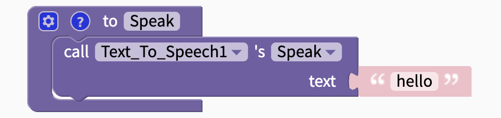
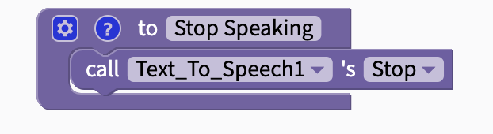
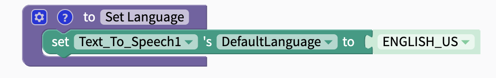
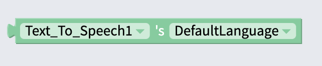

# Text to Speech

## Properties

`Default Language`: Set component to recognize text and speak in this language. Can be changed in blocks.

## Blocks

### Functions

#### Speak

Read text aloud in the specified language

#### Stop

Stop Speaking. Can be used with a [Button](button.md) to create a stop button.

### Properties

#### Set Default Language

Set default language to item from drop-down menu. Can also use [Text](text.md) block or [variable](variables.md) to set language.

#### Get Default Language

Returns current language of Text to Speech component.

