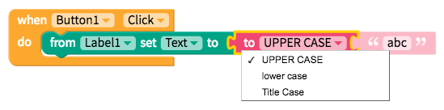
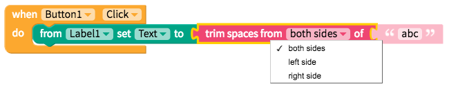

# Text

* [Text value](text.md#text-value)
* [Reformat text](text.md#reformat-text)
* [Analyze text](text.md#analyze-text)

## Text Value

### String

The most basic but most often used text block is below. You can type into this text block, or leave it empty.

### Join

Often, you'll want to join text values together with the `join` block:

### Newline

You can use the `newline` block to add a line break in a piece of text.

## Reformat Text

Use these blocks to change the content or formatting of your text. These blocks will return the reformatted text.

### Set case

Set a piece of text to UPPER CASE or lower case:

### Trim Spaces

Trim blank spaces from the left side, the right side, or both sides of a string of text:

### Replace all

Find and replace all occurrences of a substring within a string.

## Analyze Text

### Is Empty

The block below tests whether the text value is empty. Returns `true` or `false`

### Get letter

Returns the character at the specified position, where 1 is the first letter of the string.  
Returns the empty string if the length of text given is less than the position specified.

### Get substring

Returns the substring at the specified start and end position, where 1 is the first letter of the string.  
Returns the empty string if the length of text given is less than the starting position specified.

### Find first occurrence of

Returns the starting position of a substring within a string, where 1 is the first letter of the string.  
Returns 0 if the string does not contain the substring.

### Does string contain

Checks if a string contains a substring. Returns `true` or `false`. 

### Get length of string

Returns length of a given string

