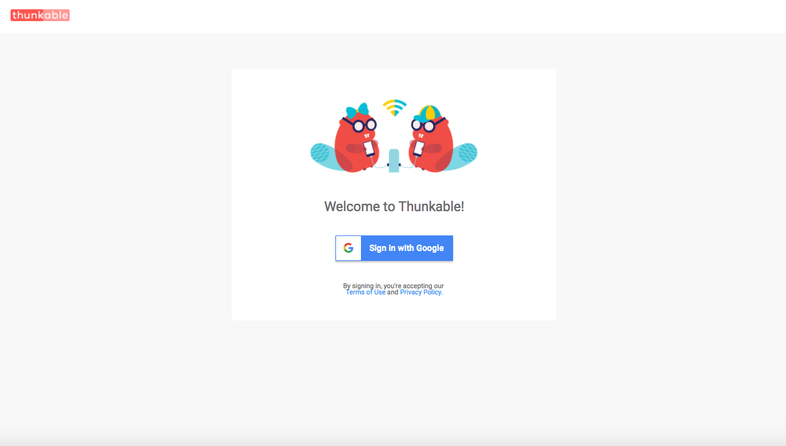
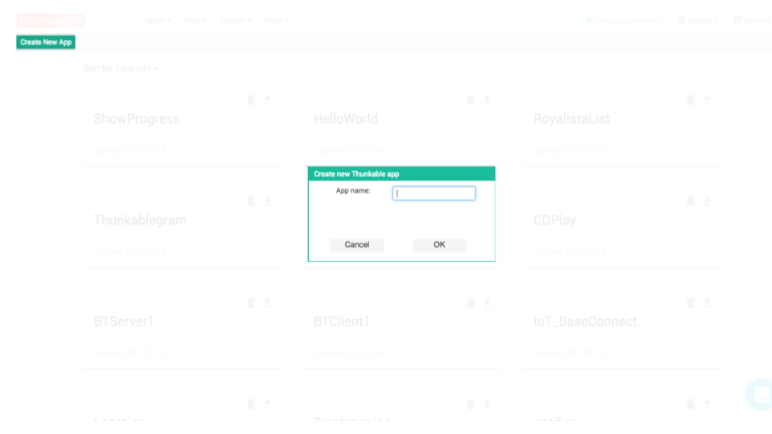
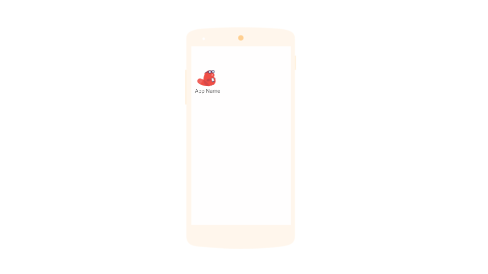
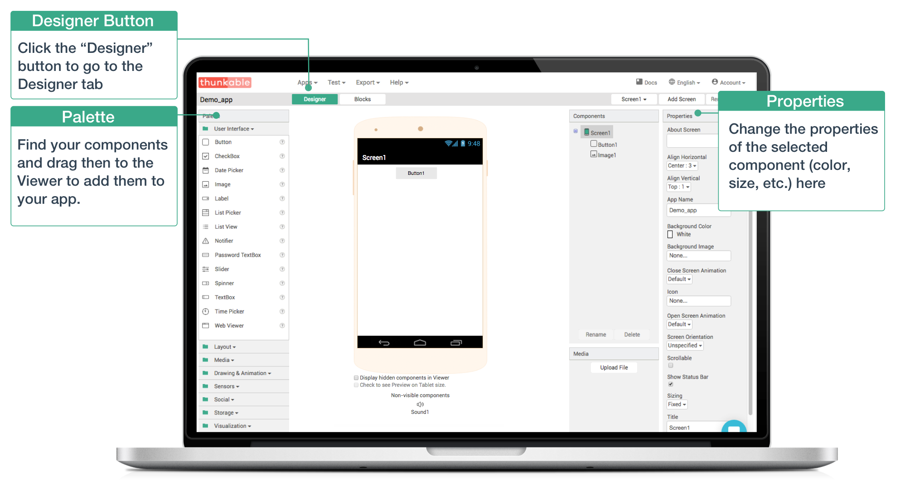
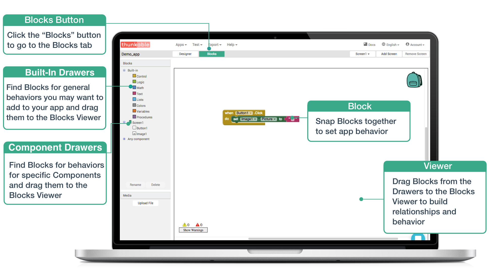
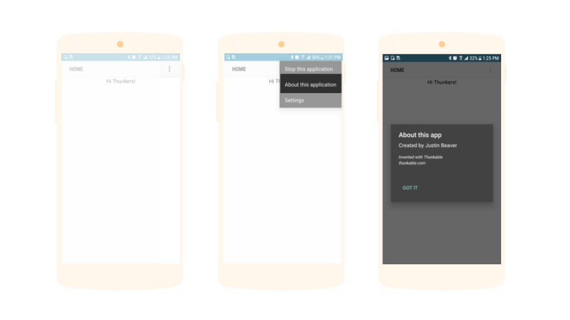

# Create

We designed Thunkable to work for non-developers by eliminating the need to write any code to build a powerful and beautiful native, mobile app. Creating your first app on Android should take only a few steps

If this is your first time on Thunkable, we highly recommend that you [watch this tutorial](https://www.youtube.com/watch?v=hZ7z3t-98O0)

* [Login](./#1--login-to-thunkable-for-android-)
* [Create a New Project](./#2--create-a-new-project)
* [Rename App and Upload App Icon](./#3--rename-app-and-upload-app-icon)
* [Add App Component\(s\)](./#step-5：-add-app-components)
* [Add Functionality](./#--step-6：-add-functionality)

If you want to give yourself credit for the app, you can also [edit "about this application"](./#about-this) \(Title must be visible\). Unfortunately, you cannot remove the part that says "Invented on Thunkable / thunkable.com"

## [Login](https://ios.thunkable.com) to Thunkable for Android

## Create a new project

1. In Thunkable, click 'Create New App'
2. Enter your Project Name.  If your name has spaces in it, we'll automatically add underscores \(\_\) to fill the spaces. The Project Name is not seen by your users except in your default package name. 

## Rename app \(and upload app icon\)

You can change your App Name to be different than your Project Name \(otherwise they will be the same by default\). The App Name is what shows up underneath your app icon on your user's phones. We have a [collection of free app icons](https://photos.google.com/u/1/share/AF1QipMY5pHOU-kbTOBQeKdX2VOtRTB8cXl5Vq9pXjnGLHSOkEK91HhbctP8Zls075V4Cg?key=S0ZoUks3MUxCV0ptMVNneHpFemxGVnJrcnZQc213) that you can use in your projects.

## A**dd app component\(s\)**

As you create your app, there are some [app limits](app-limits.md) to be aware of that will hopefully help you avoid problems in the future e.g. crashing, building issues

## **Add functionality**

## Edit "about this application"

To give yourself credit for your app, you can edit the "About this application" setting embedded in the default title bar \(Title must be visible\).

Note: You cannot remove the "Invented on Thunkable / thunkable.com"

