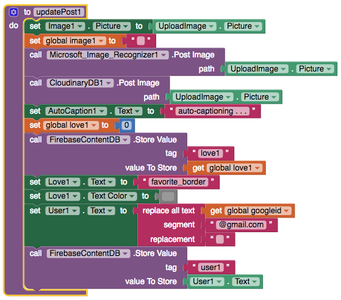
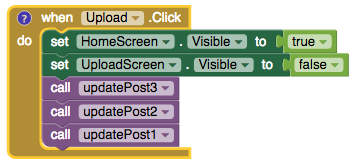

# Procedures

Procedure blocks can have inputs \(also known as arguments\) which you can add by selecting the blue settings button. Usually you define a procedure in your app and then call it when you're ready to use it in your app.

* [Define a procedure](procedures.md#define-a-procedure)
* [Call a procedure](procedures.md#call-a-procedure)

### Define a procedure

In the above example from the sample app [Thunkableagram: AI-powered Instagram](procedures.md), the procedure is named updatePost1 and encapsulates a number of events that will run when this procedure is called

### Call a procedure

The example above shows how a procedure is called like any event

