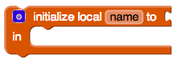

# Variables

* [Create a global variable](variables.md#create-global-variable)
* [Get a global variable](variables.md#get-a-global-variable)
* [Set a global variable](variables.md#set-a-global-variable)
* [Create a local variable](variables.md#create-a-local-variable)

### Create a global variable

There are two types of variables in apps - global and local. Global variables are available in any procedure or event while local variables can only be used for specific procedures or events.

To create a global variable, just connect this block to any basic math, text, list or color block. Clicking on `name`\_ \_will change the name of this global variable.

### Get a global variable

This block provides a way to get any variables you may have created

### Set a global variable

This block follows the same rules as get. Only variables in scope will be available in the dropdown.

### Create a local variable

This block allows you to create new variables that are only used in the procedure you run

