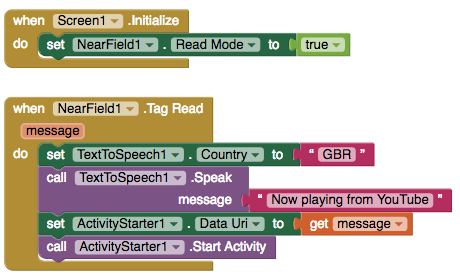

# NFC Sensor

### 

The NFC Sensor included in many phones is used to most commonly to enable tap and pay services like Apple and Android Pay. NFC tags, which require no power, are embedded not just in phones but in transit cards, laundry buttons and an increasing number of objects.

If available on the device, the NFC component supports the reading and writing of NFC text tags that have been embedded in another object only. If you don't have them already, you will need to procure readable and writable NFC tags.

The component will only also work on Screen1.

### **Read an NFC tag**

Reads an NFC tag that contains a YouTube URL and plays a specified video in the YouTube app

| Property / Event | Description |
| :--- | :--- |
| Read Mode | If 'true', the NFC sensor will read tags |
| Tag Read \(message\) | Indicates that a new tag has been detected. Currently this is only a plain text tag |
| Last Message | Refers to the last message read from an NFC tag |

### Write **an NFC tag**

| Property / Event | Description |
| :--- | :--- |
| Read Mode | If 'false' will write text to tags |
| Text to Write | Text to write on an NFC tag |
| Write Type |  |
| Tag Written | Indicates that a tag has been written |

