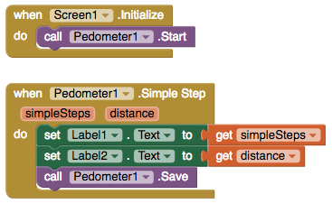

# Pedometer

###  

The Pedometer senses motion via the Accelerometer and attempts to determine if a step has been taken. Using a configurable stride length, it can estimate the distance traveled as well.

One thing to design for is that the most successful Pedometers are always on even when the app is not open. Currently, Thunkable apps generally don't work in the background when the apps are not open.

### Start the pedometer, start counting steps and distance

| Event | Description |
| :--- | :--- |
| Start | Start counting steps and distance |
| Pause | Pause counting of steps and distance |
| Resume | Resumes counting, synonym of Start |
| Stop | Stops counting steps and distance |
| Stop Detection Timeout | The duration in milliseconds of idleness \(no steps detected\) after which to go into a "stopped" state |
| Save | Saves the pedometer state to the phone. Permits permits accumulation of steps and distance between invocations of an App that uses the pedometer. Different Apps will have their own saved state |
| Reset | Resets the step counter, distance measure and time running |
| Simple Step \(simpleSteps, distance\) | When a step in any direction is detected |
| Walk Step \(walkSteps, distance\) | When a walking step is detected. A walking step is a step that appears to be involved in forward motion |
| Simple Steps | The number of simple steps taken since the pedometer has started |
| Walk Steps | The number of walk steps taken since the pedometer has started |
| Stride Length | Set the average stride length in meters. The default is 0.73 meters, or 28 inches, equivalent to the average stride length of a person |
| Distance | The approximate distance traveled in meters |
| Elapsed Time | Time elapsed in milliseconds since the pedometer was started |

.

.

