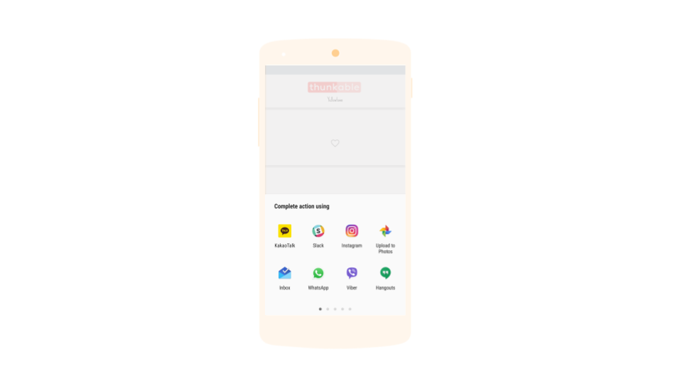

# Sharing

###  

The component will display a list of the installed apps that can handle the information provided, and will allow the user to choose one to share the content with, for instance a mail app, a social network app, a texting app, and so on.

### Share a message through another installed app

| Property / Event | Description |
| :--- | :--- |
| Share Message \(message\) | Shares a message through any capable application installed on the phone by displaying a list of the available apps and allowing the user to choose one from the list. The selected app will open with the message inserted on it |
| Share File With Message \(file, message\) | Shares both a file and a message through any capable application installed on the phone by displaying a list of available apps and allowing the user to choose one from the list. The selected app will open with the file and message inserted on it |
| Share File \(file\) | Shares a file through any capable application installed on the phone by displaying a list of the available apps and allowing the user to choose one from the list. The selected app will open with the file inserted on it |

