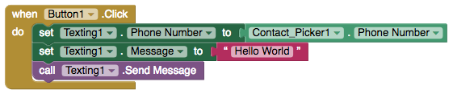

# Texting

### 

### Send a text

| Property / Event | Description |
| :--- | :--- |
| Phone Number | The number that the message will be sent to when the SendMessage method is called. The number is a text string with the specified digits \(e.g., 6505551212\). Dashes, dots, and parentheses may be included \(e.g., \(650\)-555-1212\) but will be ignored; spaces should not be included |
| Message | The message that will be sent when the Send Message method is called |
| Send Message | Sends a text message |
| Google Voice Enabled | If true, then Send Message will attempt to send messages over Wifi using Google Voice. This requires that the Google Voice app must be installed and set up on the phone or tablet, with a Google Voice account. If Google Voice Enabled is false, the device must have phone and texting service in order to send or receive messages with this component |

### Send a text automatically upon receiving one

| Property / Event | Description |
| :--- | :--- |
| Receiving Enabled | 'Foreground' \(default\), 'Always', 'Off'. If 'Off', no messages will be received. If 'Foreground', the app will respond to messages if it is running and discarded if it wasn't. If 'Always', the app will respond to messages when it is running and show a notification if it is not |
| Message Received \(number, messageText\) | When text message is received |

