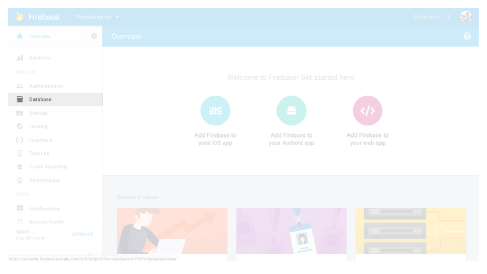
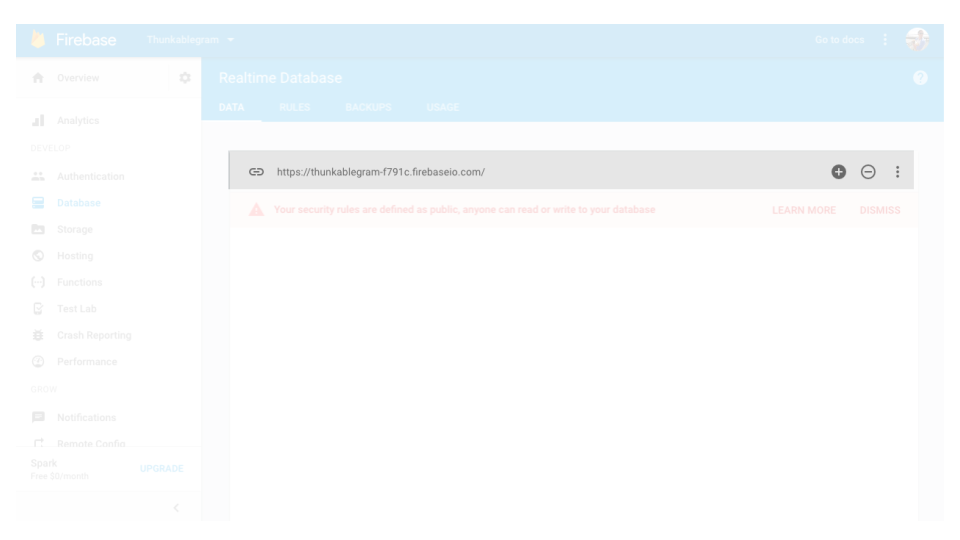
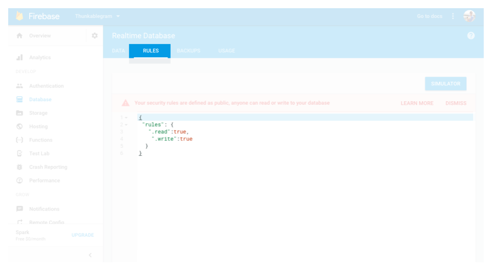
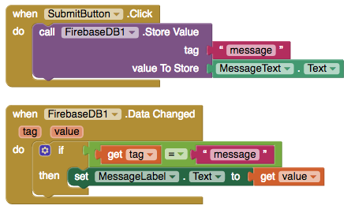
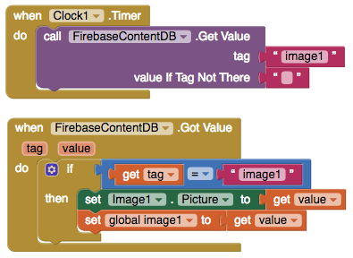

# Firebase DB

### 

The sample app [Thunkable Messaging](https://goo.gl/QYbcpW) uses a Firebase DB as a backend for person to person messaging

* [Set Up](firebase-db.md#set-up)
* Sample Blocks
  * [Send chat message using Firebase as backend](firebase-db.md#send-chat-message-using-firebase-as-a-real-time-backend)
  * [Load Images from image urls stored in Firebase](firebase-db.md#load-images-from-image-urls-stored-in-firebase)
* [Store and Retrieve Data](firebase-db.md#store-and-retrieve-data)

### Set Up

No set-up is required since Thunkable provides a default account for users to get started quickly. Once you're app is ready for prime time, we do recommend that you create your own private database for free with Firebase.

To create your own database with Firebase, please [visit this link](https://firebase.google.com/) and follow the steps below.

1. Create a new database by Adding a new project 
2. Go to the 'Database' option on the left and copy and paste the Firebase URL to your Thunkable component 
3. Set the database 'read' and 'write' rules to 'true' 

| Property | Description |
| :--- | :--- |
| Firebase URL | Thunkable provides its own url by default so that users can get started quickly.  For apps you intend to share with others, we highly recommend creating you own private database with Firebase and adding in your url |
| Firebase Token | DO NOT CHANGE. This is the token used to authenticate your app. It will be generated by default, so you should not change it |
| Project Bucket | Gets the Project Bucket name for this Firebase DB. This field is given a default name. If you are using the default Firebase database, make sure to change it to something unique so it reduces the chance of conflict with another user |
| Use Default | If checked, uses the default Firebase URL provided by Thunkable |
| Persist | If checked, variables will retain their values when off-line and the App exits. Values will be uploaded to Firebase the next time the App is run while connected to the network. This is useful for applications which will gather data while not connected to the network. AppendValue and RemoveFirst will not work correctly when off-line, they require a network connection |

### Send chat message using Firebase as a real-time backend

### Load images from image urls stored in Firebase

### Store and Retrieve Data

| Event | Description |
| :--- | :--- |
| Store Value \(tag, valueToStore\) | Asks Firebase to store the given value under the given tag |
| Data Changed \(tag, value\) | Indicates that the data in the Firebase has changed. Launches an event with the tag and value that have been updated |
| Get Value \(tag, valueIfTagNotThere\) | GetValue asks Firebase to get the value stored under the given tag. It will pass valueIfTagNotThere to GotValue if there is no value stored under the tag |
| Got Value \(tag, value\) | Indicates that a GetValue request has succeeded |
| Get TagList | Get the list of tags for this application. When complete a "TagList" event will be triggered with the list of known tags |
| Tag List \(value\) | Event triggered when we have received the list of known tags. Used with the "GetTagList" Function |
| Clear Tag \(tag\) | Remove the tag from Firebase |
| Remove First \(tag\) | Return the first element of a list and atomically remove it. If two devices use this function simultaneously, one will get the first element and the the other will get the second element, or an error if there is no available element. When the element is available, the "FirstRemoved" event will be triggered |
| First Removed \(value\) | Event triggered by the "RemoveFirst" function. The argument "value" is the object that was the first in the list, and which is now removed |
| Append Value \(tag, valueToAdd\) | Append a value to the end of a list atomically. If two devices use this function simultaneously, both will be appended and no data lost |
| Firebase Error \(message\) | Indicates an error with communicating with Firebase |
| Unauthenticate | For testing purposes only. If you are having difficulty with Thunkable Live and you are switching between different Firebase accounts, you may need to use this function to clear internal Firebase caches. You can just use the "Do It" function on this block in the blocks editor |

