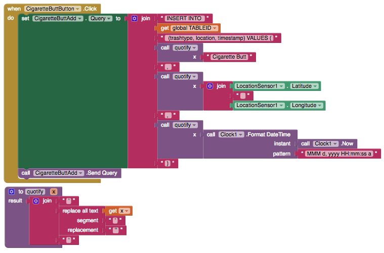

# Fusion Tables

### 

With the power of Fusion Tables does come consider set-up -- up to an hour at our last estimate. If you have a data set with 500 or less rows, we recommend using the Spreadsheets component, which requires less set up time.

This component uses the [Fusion Tables API V2.0.](fusion-tables.md)

### Set up

Applications using Fusion Tables must authenticate with Google's servers.

To get set up, please follow [these instructions from our friends at MIT App Inventor](https://docs.google.com/document/d/1HifuZqz5xu0KPS-e4oUv-t-nQoUQ8VMNyh_y6OjZkc0/edit). It will take you through the 5 steps of set-up including creating a Google Developers account, a new project under that account, connecting that project to the Fusion Tables API, a service account for the project, and a new Fusion Table.

**Important note**: Initial set up time can take up to one hour \(due to changes from Google with the latest API\)

| Property | Description |
| :--- | :--- |
| API Key | Your Google API Key. See above for details on obtaining an API key |
| Key File | Specifies the path of the private key file. This key file is used to get access to the FusionTables API through Service Authentication |
| Service Account Email | The Service Account Email Address used for Service Authentication |
| Use Service Authentication | If checked \(recommended\), indicates that the service account should be used for authentication |

### Querying Data

| Event | Description |
| :--- | :--- |
| GetRows \(tableId, columns\) | Gets all the rows from a Fusion Table that meet certain conditions. The tableId field \(required\) is the id of the Fusion Table. The columns field is a comma-separated list of the columns to retrieve. The conditions field specifies what rows to retrieve from the table \(for example, the rows in which a particular column value is not null\) |
| Get Rows With Conditions \(tableId, columns, conditions\) | Gets all the rows from a Fusion Table that meet certain conditions. The tableId field \(required\) is the id of the Fusion Table. The columns field is a comma-separated list of the columns to retrieve. The conditions field specifies what rows to retrieve from the table \(for example, the rows in which a particular column value is not null\) |
| Got Result \(result\) | Indicates that the Fusion Tables query has finished processing and returned with a result. The result of the query will generally be returned in CSV format, and can be converted to list format using the "list from csv table" or "list from csv row" blocks |
| Send Query | Send the query to the Fusion Tables server. Helpful if you are creating a custom query. For legal query formats and examples, see the [Fusion Tables API V2.0 reference manual](fusion-tables.md). Note that you do not need to worry about UTF-encoding the query. You must make sure the query follows the syntax described in the reference manual. Note that capitalization for names of columns is necessary and that single quotes must be used around column names if there are spaces in them |
| ~~Do Query~~ | Deprecated at the end of 2012 |
| ~~Forget Login~~ | Forget the end-user's login credentials. Do not use since it has no effect on Service Authentication |

### Uploading Data

| Event | Description |
| :--- | :--- |
| InsertRow \(tableId, columns, values\) | Inserts a row into the specified Fusion Table. The tableId field is the id of the Fusion Table. The columns field is a comma-separated list of the columns into which to insert values. The values field specifies what values to insert into each column |

### Custom SQL queries with Fusion Tables

The Send Query function lets you create a range of custom queries to Fusion Tables. The full range of what is available is [here](https://developers.google.com/fusiontables/docs/v2/getting_started). You may need add a function that adds "quotes" to your data elements

