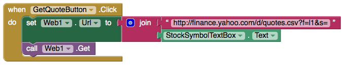
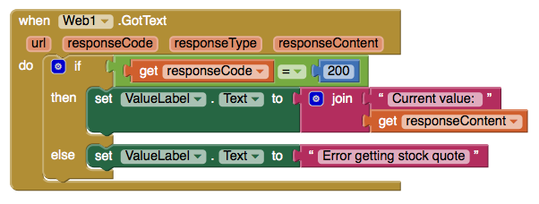

# Web

### 


We recommend this component for more advanced users since it requires both connecting to the Web API of that service and formatting the data in a useable way for your app, also known as parsing.


### Web API service settings

| Property / Event | Description |
| :--- | :--- |
| Url | The url for the web request |
| Allow Cookies | If 'true', saves cookies from a response and used in subsequent requests. We recommend setting to true if you want to avoid having to login in each time you send a request |
| Clear Cookies | Clears all cookies for this component |
| Save Response | If 'true', indicates whether the response should be saved in a file |
| Response File Name | The name of the file where the response should be saved. If Save Response is true and Response File Name is empty, then a new file name will be generated |
| Request Headers | The request headers, as a list of two-element sublists. The first element of each sublist represents the request header field name. The second element of each sublist represents the request header field values, either a single value or a list containing multiple values |

### Retrieving data from Yahoo Finance's Web API service using HTTP GET

| Event | Description |
| :--- | :--- |
| Get | Performs an HTTP GET request using the Url property and retrieves the response. If the Save Response property is 'false', the Got Text event will be triggered. If the Save Response property is 'true', the response will be saved in a file and the Got File event will be triggered. The Response File Name property can be used to specify the name of the file |
| Got Text \(url, responseCode, responseType, responseContent\) | After request has finished. If ok, the responseCode = 200. Corresponds to when Save Response is set to 'false'. |
| Got File \(url, responseCode, responseType, responseContent\) | After request has finished. If ok, the responseCode = 200. Corresponds to when Save Response is set to 'true.' The Response File Name property can be used to specify the name of the file |
| Text Html Text Decode \(htmlText\) | Decodes the given HTML text value. HTML character entities such as &, &lt;, &gt;, ', and " are changed to &, &lt;, &gt;, ', and ". Entities such as &\#xhhhh, and &\#nnnn are changed to the appropriate characters |
| Any XMLTextDecode\(text XmlText\) | Decodes the given XML string to produce a list structure. See the Thunkable documentation on "Other topics, notes, and details" for information |
| Any Json Text Decode \(jsonText\) | Decodes the given JSON encoded value to produce a corresponding Thunkable value. A JSON list \[x, y, z\] decodes to a list \(x y z\), A JSON object with name A and value B, \(denoted as A:B enclosed in curly braces\) decodes to a list \(\(A B\)\), that is, a list containing the two-element list \(A B\) |

### Uploading data to a web server using HTTP POST and PUT

The POST request creates a new field of data whereas the PUT request can update an existing field of data or create a new one

| Event | Description |
| :--- | :--- |
| Post Text \(text\) | Performs an HTTP POST request using the Url property and the specified text. The characters of the text are encoded using UTF-8 encoding. If the Save Response property is 'true', the response will be saved in a file and the Got File event will be triggered. The response File Name property can be used to specify the name of the file. If the Save Response property is 'false', the Got Text event will be triggered |
| Post Text With Encoding \(text, encoding\) | Performs an HTTP POST request using the Url property and the specified text. The characters of the text are encoded using the given encoding. If the Save Response property is true, the response will be saved in a file and the Got File event will be triggered. The Response File Name property can be used to specify the name of the file. If the Save Response property is false, the Got Text event will be triggered |
| Post File \(path\) | Performs an HTTP POST request using the Url property and data from the specified file. If the Save Response property is 'true', the response will be saved in a file and the Got File event will be triggered. The Response File Name property can be used to specify the name of the file. If the Save Response property is 'false', the GotText event will be triggered |
| Text Build Request Data \(list\) | Converts a list of two-element sublists, representing name and value pairs, to a string formatted as application/x-www-form-url encoded media type, suitable to pass to PostText |
| Put Text \(text\) | Performs an HTTP PUT request using the Url property and the specified text. The characters of the text are encoded using UTF-8 encoding. If the Save Response property is 'true', the response will be saved in a file and the Got File event will be triggered. The response File Name property can be used to specify the name of the file. If the Save Response property is 'false', the Got Text event will be triggered |
| Put Text With Encoding \(text, encoding\) | Performs an HTTP PUT request using the Url property and the specified text. The characters of the text are encoded using the given encoding. If the Save Response property is true, the response will be saved in a file and the Got File event will be triggered. The Response File Name property can be used to specify the name of the file. If the Save Response property is false, the Got Text event will be triggered |
| Put File \(path\) | Performs an HTTP PUT request using the Url property and data from the specified file. If the Save Response property is 'true', the response will be saved in a file and the Got File event will be triggered. The Response File Name property can be used to specify the name of the file. If the Save Response property is 'false', the GotText event will be triggered |

### Deleting data from a web server using HTTP DELETE

| Event | Description |
| :--- | :--- |
| Delete | Performs an HTTP DELETE request using the Url property and retrieves the response. If the Save Response property is 'true', the response will be saved in a file and the Got File event will be triggered. The Response File Name property can be used to specify the name of the file. If the Save Response property is 'false', the GotText event will be triggered |

