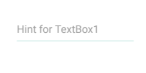

# User Interface

One of the first defining features of smartphones was the touch screen interface, which enabled developers to utilize all parts of a screen to perform distinct actions, unleashing an almost limitless number of user interface options.

Below are the different touch interface components and what they look like on a Samsung S6 phone by default

| [Button](button.md) |  | [Label](label.md) |  |
| :--- | :--- | :--- | :--- |
| [Switch](https://github.com/thunkable/thunkable-docs/tree/4a752596e288fca776105e94dc5e863bb9a3e25a/android/components/user-interface/toggle.md) |  | [Toggle](https://github.com/thunkable/thunkable-docs/tree/4a752596e288fca776105e94dc5e863bb9a3e25a/android/components/user-interface/toggle.md) |  |
| [TextBox](textbox-+-password-+-email-picker.md) |  | [Password TextBox](textbox-+-password-+-email-picker.md) |  |
| [ListPicker](listpicker-+-listview-+-spinner-+-checkbox.md) |  | [ListView](listpicker-+-listview-+-spinner-+-checkbox.md) |  |
| [Spinner](listpicker-+-listview-+-spinner-+-checkbox.md) |  | [CheckBox](listpicker-+-listview-+-spinner-+-checkbox.md) |  |
| [Slider](slider.md) |  | [Notifier](notifier.md) |  |
| [DatePicker](datepicker-+-timepicker.md) |  | [TimePicker](datepicker-+-timepicker.md) |  |

