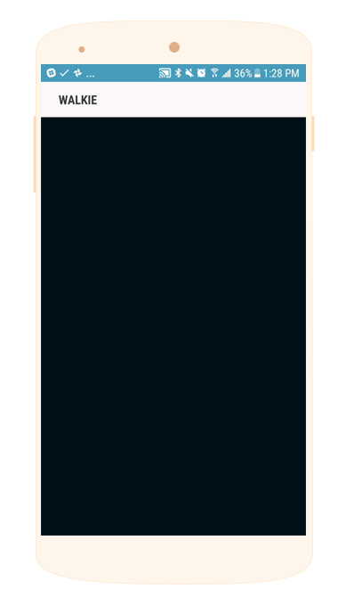
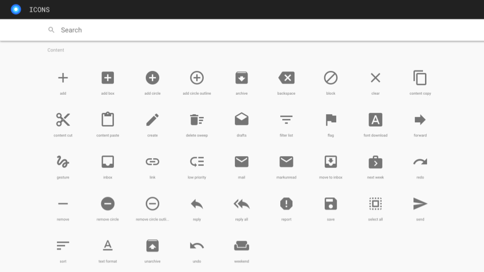
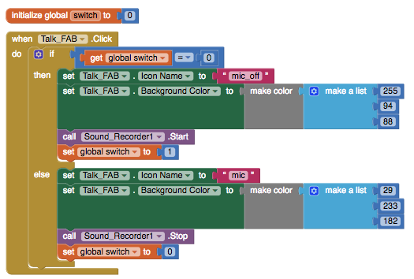

# Floating Action Button

### 

Material Design FABs can be standard sized \(56 x 56 dp\) or mini \(40 x 40 dp\) and can be customized both in terms of color and the icon on the button.

We want to give a big thank you to our awesome Power Thunkers [@pavi2140](https://community.thunkable.com/t/fab-extension-material-ui-feature/3488) and [@Andres\_Cotes](https://community.thunkable.com/t/fab-with-material-icon-ttf-paid-extension/4712) for their amazing FAB extensions which were the inspirations for how we designed this component.

Note: The Floating Action Button is not yet visible on the Phone Previewer when you add it to your app. It is visible during Live Testing and when you Export your app.

* [Set Screen Orientation to 'Portrait'](floating-action-button.md#set-screen-orientation-to-portrait)
* [Position your FAB](floating-action-button.md#position-your-fab)
* [Select your icon](floating-action-button.md#select-your-icon)
* [Style the FAB](floating-action-button.md#style-the-fab)
* [Add animation to your FAB](floating-action-button.md#add-animation-to-your-fab)

[Download App Source Code Here](https://goo.gl/PwQ2uA)

### Set Screen Orientation to 'Portrait'

For the best performance, please set the Screen Orientation to Portrait otherwise the FAB may disappear from your screen.

### Position your FAB

The most common position for FAB is on the bottom right with a padding of 16 or 24 dp from the bottom and right. There is also an alternate use case as specified by Material Design standards. We recommend sticking to these guidelines in most cases since users are familiar with these positions and will more likely engage in the primary action of your app.

### Select your icon

For user's convenience, Thunkable has automatically preloaded the Material Icon Font into the FAB and you can select from the entire library the 'Icon Name'. If the name has two words e.g. mic off, you will need to add an underscore e.g. mic\_off.

To see more options, [navigate here to the library](https://material.io/icons/)

### Style the FAB

| Property | Description |
| :--- | :--- |
| Icon Name | Default \(Add\). You can choose any icon from the [Material Icon Font](https://material.io/icons/). If the name has two words e.g. mic off, you will need to add an underscore e.g. mic\_off. |
| Icon Color | Default \(White\). You can choose any color on the Designer palette or customize the color to any RGB value in the Blocks edito |
| Background Color | Default \(Blue\). You can choose any color on the Designer palette or customize the color to any RGB value in the Blocks editor |
| Padding Bottom \(dp\) | Margin from bottom edge of phone in dp, or device-independent pixels. For bottom-right FABs, we recommend a bottom padding of 24 dp |
| Padding Right \(dp\) | Margin from right edge of phone in dp, or device-independent pixels. For bottom-right FABs, we recommend a right padding of 24 dp |
| Button Size | Default \(Standard 56 x 56 dp\) or mini \(40 x 40 dp\) which are good as secondary buttons from a standard FAB. |
| Animation Duration \(milliseconds\) | Applies only to instances where you change the FAB Icon Name and specifies the duration of the fade animation when switching between the icons. |
| Visible | If checked, the button will be visible on the screen |

### Add animation to your FAB

Since FABs often represent the primary action in an app, developers will often add animation to transition between FABs depending different events that have been triggered

| Event | Description |
| :--- | :--- |
| Click | User tapped and releases the button |

