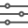

# Slider

###  

### **Appearance**

| Property | Description |
| :--- | :--- |
| Width | Width in pixels, percent, 'Automatic' or 'Fill' \(recommended\) |
| Color Left | Default \(Orange\). You can choose any color on the Designer palette or customize the color to any RGB value in the Blocks editor |
| Color Right | Default \(Gray\). You can choose any color on the Designer palette or customize the color to any RGB value in the Blocks editor |
| Visible | If checked, the slider will be visible on the screen |

### Functionality

| Event / Property | Description |
| :--- | :--- |
| Min Value | Sets the minimum value of the slider |
| Max Value | Sets the maximum value of the slider |
| Thumb Position | Sets the position of the slider thumb. Cannot be below the Min Value or exceed the Max Value |
| Thumb Enabled | Sets whether or not to display the slider thumb |
| Position Changed \(Thumb Position\) | If position of slider thumb has changed |

