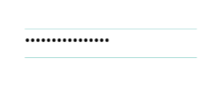

# TextBox + Password + Email Picker

####   +    +  

Textboxes are a popular input component especially in apps with forms and login pages.

A Password Text Box is the same as a TextBox component, except that it displays an encoded character \* instead of the characters typed by the user.

An Email Picker is a TextBox that pre-populates email addresses within a user's contacts as the user begins to type

|  |  |  |  |
| :--- | :--- | :--- | :--- |
|  | TextBox | Password TextBox | Email Picker |
|  |  |  |  |
| Common use case | Username inputs for app login | Password inputs for app login | Email login |

### **Appearance**

| Property | Description |
| :--- | :--- |
| Text | Optional text that will display in the textbox |
| Hint | Text that appears faintly in the input box to provide a hint for the user.  Can only be seen if the 'Text' property is empty |
| MultiLine | If checked, the textbox can accept multiple lines of input, which are entered using the return key. For single line textboxes, there is a 'done' key instead of a 'return' key which simultaneously hides the keyboard.  Apps that accept multiline text boxes should also call the HideKeyboard event |
| Numbers Only | If checked, the textbox accepts only numbers, which can input a decimal point and an optional leading minus sign. This applies to keyboard input only. Even if true, you can use \[set Text to\] to enter any text |
| Height | Height in pixels, percent, 'Automatic' or 'Fill' |
| Width | Width in pixels, percent, 'Automatic' or 'Fill' |
| Background Color | Default \(White\). You can choose any color on the Designer palette or customize the color to any RGB value in the Blocks editor |
| Text Color | Default \(Black\). You can choose any color on the Designer palette or customize the color to any RGB value in the Blocks editor |
| Underline Color | Default \(Material Light Green\). You can choose any color on the Designer palette or customize the color to any RGB value in the Blocks editor |
| Text Alignment | Left, center \(recommended\) or right |
| Font Bold | If checked, text is displayed in **bold** |
| Font Italic | If checked, text is displayed in _italic_ |
| Font Size | Point size for text |
| Font Typeface | Default \(Roboto\), Roboto Regular, Roboto Thin, Sans Serif, Serif, and Monospace. You can upload your own custom font \(.ttf\) |
| Visible | If checked, the textbox will be visible on the screen |

### Functionality

| Event | Description |
| :--- | :--- |
| Request Focus | User sets the textbox to active |
| Got Focus | User activates textbox for input by touching it |
| Lost Focus | User deactivates textbox for input by touching another component |
| Hide Keyboard | Hides the keyboard for multiline textboxes |
| Enabled | If checked, textbox functionality is enabled |

