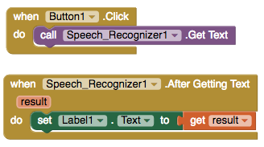

# Speech Recognizer

### 

The speech recognizer is used in the sample app [ThunkableChat: Chat with Instant Translation](https://www.gitbook.com/book/albertching/thunkable-docs/edit#)

### Launching the Speech Recognizer and setting a label to print the results

### Functionality

| Event | Description |
| :--- | :--- |
| Get Text | Launches Speech Recognizer |
| Before Getting Text | Before the Speech Recognizer is launched |
| After Getting Text \(result\) | After the Speech Recognizer recognizes speech, the 'result' is the text transcription |

