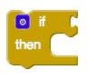
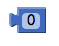
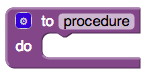

# ⎍ Blocks

Built-in blocks are available regardless of which components are in your project. In addition to these blocks, each component in your project has its own set of blocks specific to its own events, methods, and properties. This is an overview of all of the Built-In Blocks available in the Blocks Editor

| [Control](control.md) | [Logic](logic.md) | [Math](math.md) | [Text](text.md) |
| :--- | :--- | :--- | :--- |
|  |  |  |  |
| [**Lists**](lists.md) | [**Colors**](colors.md) | [**Variables**](variables.md) | [**Procedures**](procedures.md) |
|  |  |  |  |

