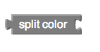

# Colors

* [Basic color](colors.md#basic-color)
* [Create a custom color](colors.md#create-a-custom-color)
* [Calculate color](colors.md#calculate-color)

### Basic color

This is a basic color block. It has a small square shape and has a color in the middle that represents the color stored internally in this block.

If you click on the color in the middle, a pop-up appears on the screen with a table of 70 colors that you can choose from. Clicking on a new color will change the current color of your basic color block

### Create a custom color

There are a number of ways to create color in a digital application from 6-digit HEX codes to Hue-Saturation-Values. On Thunkable, color is created using RGBA, where R is the amount of Red, G is Green, B is Blue and A is the transparency from 0 to 1 with 0 being fully transparent. You can enter just the RGB values and it will default the A value to 1, or fully opaque.

### **Calculate color**

Split color does the opposite of make color. It takes in a color: a color block, variable holding a color, or property from one of the components representing a color and returns a list of the RGB values in that color's RGB code

