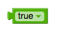
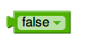
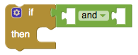
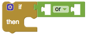

# Logic

* [Setting component properties to 'true' or 'false'](logic.md#setting-component-properties-to-true-or-false)
* [Advanced conditions on when things happen](logic.md#advanced-conditions-on-when-things-happen)

### Setting component properties to 'true' or 'false'

\(a\)  \(b\) 

\(a\) **True** Represents the constant value true. Use it for setting boolean property values of components, or as the value of a variable that represents a condition

\(b\) **False** Represents the constant value false. Use it for setting boolean property values of components, or as the value of a variable that represents a condition.

### Advanced conditions on when things happen

\(a\) \(b\) 

\(a\) **Two conditions must be true** Tests whether all of a set of logical conditions are true. The result is true if and only if all the tested conditions are true. When you plug a condition into the test socket, another socket appears so you can add another condition. The conditions are tested left to right, and the testing stops as soon as one of the conditions is false. If there are no conditions to test, then the result if true. You can consider this to be a logician's joke

\(b\) **Either condition must be true** Tests whether any of a set of logical conditions are true. The result is true if one or more of the tested conditions are true. When you plug a condition into the test socket, another socket appears so you can add another condition. The conditions are tested left to right, and the testing stops as soon as one of the conditions is true. If there are no conditions to test, then the result is false

