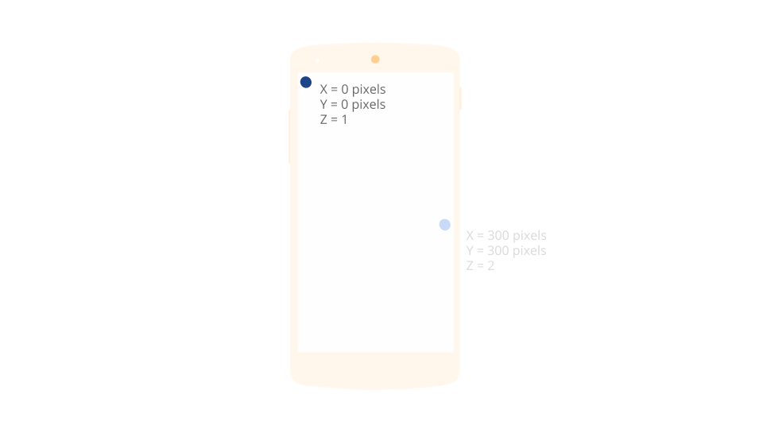
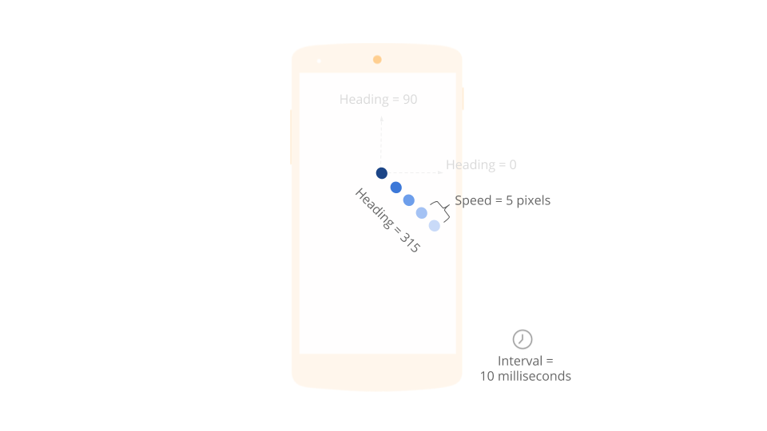
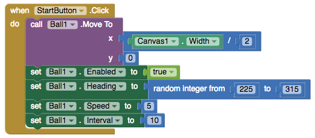
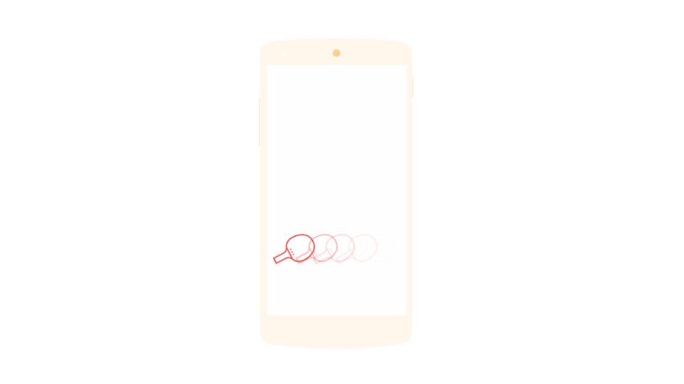
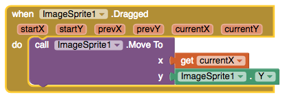
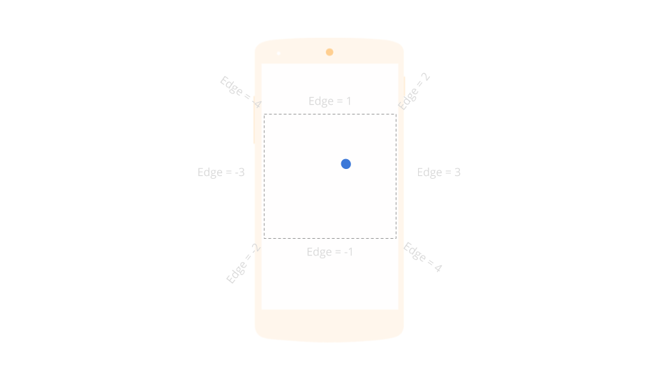
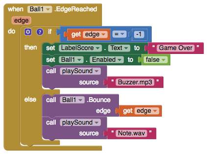

# Image Sprite + Ball

  + 

The difference between an Image Sprite and a Ball is that an Image Sprite can get its appearance from an image file, while a Ball's appearance can only be changed by varying its PaintColor and Radius properties.

The sample app [Thunkable Pong](https://www.gitbook.com/book/albertching/thunkable-docs/edit#) uses both an image sprite and a ball to create a fun game of one player Pong

* [Styling the Ball](image-sprite-+-ball.md#styling-the-ball)
* [Styling the Image Sprite](image-sprite-+-ball.md#styling-the-image-sprite)
* [Positioning the Sprite](image-sprite-+-ball.md#position-sprite)
* [Setting a Sprite in motion](image-sprite-+-ball.md#sprite-motion)
* [Moving a Sprite with touch](image-sprite-+-ball.md#touch-sprite)
* [Bouncing Sprites](image-sprite-+-ball.md#bouncing-sprite)
* [Sprite Collisions](image-sprite-+-ball.md#sprite-collisions)

### Styling the Ball

| Property | Description |
| :--- | :--- |
| Paint Color | The color of the ball. Default \(Black\). You can choose any color on the Designer palette or customize the color to any RGB value in the Blocks editor |
| Radius | The radius of the ball |
| Visible | If checked, the ball will be visible on the screen |

### Styling the Image Sprite

| Property | Description |
| :--- | :--- |
| Height | Height in pixels, percent, 'Automatic' or 'Fill' |
| Width | Width in pixels, percent, 'Automatic' or 'Fill' |
| Picture | You can upload an image to your app for the sprite |
| Rotates | If checked, the sprite image rotates to match the sprite's heading. If unchecked, the sprite image does not rotate when the sprite changes heading. The sprite rotates around its center point. |
| Visible | If checked, the image sprite will be visible on the scree |

### Positioning the Sprite {#position-sprite}

| Property | Description |
| :--- | :--- |
| X | In pixels from left. The horizontal coordinate of the left edge of the sprite, increasing as the sprite moves to the right |
| Y | In pixels from top. The vertical coordinate of the top edge of the sprite, increasing as the sprite moves down |
| Z | Integers with higher numbers layered on top. How the sprite should be layered relative to other sprites, with higher-numbered layers in front of lower-numbered layers |

### Setting a Sprite in motion {#sprite-motion}

### **Set a Ball in motion at a random angle between 225 and 315 degrees at a speed of 5 pixels per 10 milliseconds**

| Property | Description |
| :--- | :--- |
| Heading \(direction angle\) | Returns the sprite's heading in degrees above the positive x-axis. Zero degrees is toward the right of the screen; 90 degrees is toward the top of the screen. |
| Speed \(pixels / interval\) | In pixels per interval. The speed at which the sprite moves in pixels per interval |
| Interval \(milliseconds\) | The interval in milliseconds at which the sprite's position is updated. For example, if the interval is 50 and the speed is 10, then the sprite will move 10 pixels every 50 milliseconds |
| Point In Direction \(x, y\) | Turns the sprite to point towards the point with coordinates as \(x, y\) |
| Point Towards \(target\) | Turns the sprite to point towards a designated target sprite. The new heading will be parallel to the line joining the centerpoints of the two sprites |
| Enabled | If checked, sprite will move when its speed is non-zero |

### Moving a Sprite with touch {#touch-sprite}

### Moving an Image Sprite horizontally when dragged

| Event | Description |
| :--- | :--- |
| Touched \(x, y\) | When the user touches the sprite and then immediately lifts finger: provides the \(x,y\) position of the touch, relative to the upper left of the canvas |
| Touch Down \(x, y\) | When the user begins touching the sprite \(places finger on sprite and leaves it there\): provides the \(x,y\) position of the touch, relative to the upper left of the canvas |
| Touch Up \(x, y\) | When the user stops touching the sprite \(lifts finger after a TouchDown event\): provides the \(x,y\) position of the touch, relative to the upper left of the canvas |
| Dragged \(startX, startY, prevX, prevY, currentX, currentY\) | Handler for Dragged events. On all calls, the starting coordinates are where the screen was first touched, and the "current" coordinates describe the endpoint of the current line segment. On the first call within a given drag, the "previous" coordinates are the same as the starting coordinates; subsequently, they are the "current" coordinates from the prior call. Note that the Sprite won't actually move anywhere in response to the Dragged event unless MoveTo is specifically called. |
| Flung \(x, y, speed, heading, xvel, yvel\) | When a fling gesture \(quick swipe\) is made on the sprite: provides the \(x,y\) position of the start of the fling, relative to the upper left of the canvas. Also provides the speed \(pixels per millisecond\) and heading \(0-360 degrees\) of the fling, as well as the x velocity and y velocity components of the fling's vector. |
| Move To \(x, y\) | Moves the sprite so that its left top corner is at the specfied x and y coordinates. |

### Bouncing Sprites {#bouncing-sprite}

### Keep bouncing unless the ball hits the bottom edge \(Game Over\)

| Event | Description |
| :--- | :--- |
| Edge Reached \(edge\) | Event handler called when the sprite reaches an edge of the screen. If Bounce is then called with that edge, the sprite will appear to bounce off of the edge it reached. Edge here is represented as an integer that indicates one of eight directions north\(1\), northeast\(2\), east\(3\), southeast\(4\), south \(-1\), southwest\(-2\), west\(-3\), and northwest\(-4\) |
| Bounce \(edge\) | Makes this sprite bounce, as if off a wall. For normal bouncing, the edge argument should be the one returned by EdgeReached |
| Move Into Bounds | Moves the sprite back in bounds if part of it extends out of bounds, having no effect otherwise. If the sprite is too wide to fit on the canvas, this aligns the left side of the sprite with the left side of the canvas. If the sprite is too tall to fit on the canvas, this aligns the top side of the sprite with the top side of the canvas |

### Sprite Collisions {#sprite-collisions}

| Event | Description |
| :--- | :--- |
| Collided With \(other\) | Handler for CollidedWith events, called when two sprites collide. Note that checking for collisions with a rotated ImageSprite currently checks against the sprite's unrotated position. Therefore, collision checking will be inaccurate for tall narrow or short wide sprites that are rotated |
| No Longer Colliding With \(other\) | Event indicating that a pair of sprites are no longer colliding |
| Colliding With \(other\) | Indicates whether a collision has been registered between this sprite and the passed sprite |

