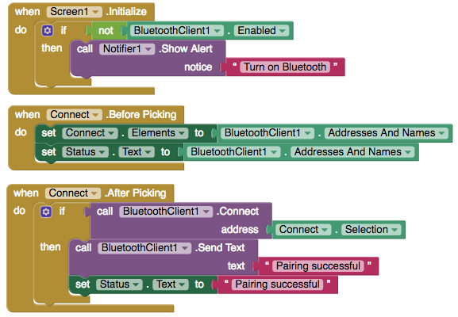
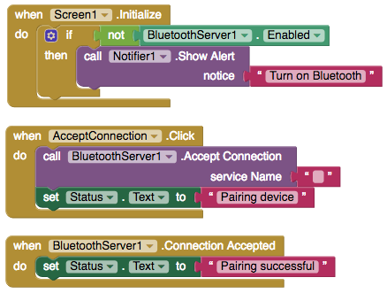

# Bluetooth Client + Server

### 

Bluetooth is the communications technology with a funny name. 

There are two forms of Bluetooth – classic Bluetooth, which is used in this component, and a newer version known as Bluetooth low energy, Bluetooth BLE, Bluetooth LE or Bluetooth Smart – all referring to the same new technology. The newest Android devices running Android 4.3 or newer, usually support the newest Bluetooth Smart technology.

There is a separate [Bluetooth low energy](http://iot.appinventor.mit.edu/#/bluetoothle/bluetoothleintro) extension created by our friends at App Inventor that uses Bluetooth low energy to communicate with an Arduino.

### Pairing Two Devices via Bluetooth

Setting up a Bluetooth devices involves first “pairing” the two devices and establishing a connection. The Bluetooth Client component sends the connection request and the Bluetooth Server component accepts the request.

### Send the request \(Bluetooth Client\)

Uses a ListPicker to see available devices, a notifier to alert the user if Bluetooth is off and a label to update the status

| Property / Event | Description |
| :--- | :--- |
| Available | Whether Bluetooth is available on the device |
| Enabled | If 'true', Bluetooth is enabled on the device |
| Addresses And Names | The addresses and names of paired Bluetooth devices |
| Connect \(address\) | Connect to the Bluetooth device with the specified address and the Serial Port Profile \(SPP\). Returns 'true' if the connection was successful |
| Connect With UUID \(address, uuid\) | Connect to the Bluetooth device with the specified address and UUID. Returns 'true' if the connection was successful |
| Is Connected | If 'true', device is connected |
| Disconnect | Disconnect from the connected Bluetooth device |
| Is Device Paired \(address\) | Checks whether the Bluetooth device with the specified address is paired |

### Accept the request \(Bluetooth Server\)

| Property | Description |  |
| :--- | :--- |
| Available | Whether Bluetooth is available on the device |  |
| Enabled | If 'true', Bluetooth is enabled on the device |  |
| Is Accepting | Tells whether this BluetoothServer component is accepting an incoming connection |  |
| Accept Connection \(serviceName\) | Accept an incoming connection with the Serial Port Profile \(SPP\) |  |
| Accept Connection With UUID \(serviceName, uuid\) | Accept an incoming connection with a specific UUID |  |
| Is Connected | If 'true', device is connected |  |
| Disconnect | Disconnect from the connected Bluetooth device |  |
| Stop Accepting | Stop accepting an incoming connection |  |

### Communication Settings \(Bluetooth Client and Server\)

| Property / Event | Description |
| :--- | :--- |
| Character Encoding | 'UTF-8' or others. The character encoding to use when sending and receiving text |
| Delimiter Byte | The delimiter byte to use when passing a negative number for the number Of Bytes parameter when calling Receive Text, Receive Signed Bytes, or Receive Unsigned Bytes |
| High Byte First | Whether 2 and 4 byte numbers should be sent and received with the high \(or most significant\) byte first. Check the documentation for the device with which your app will be communicating for the appropriate setting. This is also known as big-endian |
| Secure | If 'true', will invoke SSP \(Simple Secure Pairing\), which is supported on devices with Bluetooth v2.1 or higher. When working with embedded Bluetooth devices, this property may need to be set to 'false' |

### Send via Bluetooth \(Bluetooth Client and Server\)

Unlike connected devices on Wi-Fi which can send larger files like images, connected bluetooth devices can send and receive text and bytes of information

| Event | Description |
| :--- | :--- |
| Send Text \(text\) | Send text to the connected Bluetooth device |
| Send 1Byte Number \(number\) | Send a 1-byte number to the connected Bluetooth device |
| Send 2Byte Number\(number\) | Send a 2-byte number to the connected Bluetooth device |
| Send 4Byte Number\(number\) | Send a 4-byte number to the connected Bluetooth device |
| Send Bytes \(list\) | Send a list of byte values to the connected Bluetooth device |

### Receive via Bluetooth \(Bluetooth Client and Server\)

| Event | Description |  |
| :--- | :--- |
| Bytes Available To Receive | Returns an estimate of the number of bytes that can be received without blocking |  |
| Receive Text \(numberOfBytes\) |  | Receive text from the connected Bluetooth device. If numberOfBytes is less than 0, read until a delimiter byte value is received |
| Receive Signed Bytes \(numberOfBytes\) | Receive multiple signed byte values from the connected Bluetooth device. If numberOfBytes is less than 0, read until a delimiter byte value is received |  |
| Receive Signed1 Byte Number | Receive a signed 1-byte number from the connected Bluetooth device |  |
| Receive Signed2 Byte Number | Receive a signed 2-byte number from the connected Bluetooth device |  |
| Receive Signed4 Byte Number | Receive a signed 4-byte number from the connected Bluetooth device |  |
| Receive Unsigned Bytes \(numberOfBytes\) | Receive multiple unsigned byte values from the connected Bluetooth device. If numberOfBytes is less than 0, read until a delimiter byte value is received |  |
| Receive Unsigned1 Byte Number | Receive an unsigned 1-byte number from the connected Bluetooth device |  |
| Receive Unsigned2 Byte Number | Receive an unsigned 2-byte number from the connected Bluetooth device |  |
| Receive Unsigned4 Byte Number | Receive an unsigned 4-byte number from the connected Bluetooth device |  |

