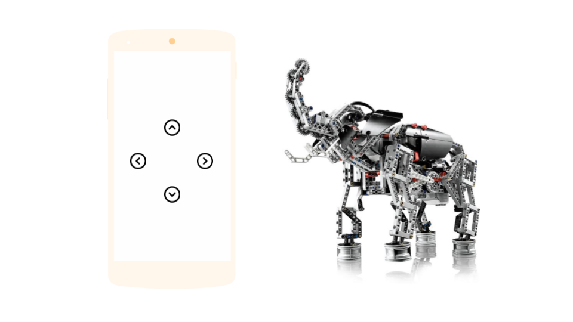

# Lego Mindstorms


Lego was the inspiration for the blocks that are a core part of the Thunkable app building experience


Lego Mindstorms include an intelligent brick computer that controls the system, a set of modular sensors and motors, and [Lego](https://en.wikipedia.org/wiki/Lego) parts from the [Technic](https://en.wikipedia.org/wiki/Lego_Technic) line to create the mechanical systems. EV3 is the current version of Lego Minstorms and NXT has now been retired.

LEGO and MINDSTORMS are registered trademarks of the LEGO Group.

## Add a Bluetooth Client component to set up your Lego Mindstorm component\(s\)

All of these components have a Bluetooth Client property that tells which Bluetooth Client component to use for communication with the robot. You will need to explicitly add a Bluetooth Client component to your project.

If you have one robot, you should have one BluetoothClient component. If you are lucky enough to have two robots and you want to control both of them simultaneously from one application, you'll need two BluetoothClient components in your project.

| Property | Description |
| :--- | :--- |
| Bluetooth Client | The BluetoothClient component that should be used for communication |

## Programming your robot

| EV3 | NXT | Description |
| :--- | :--- | :--- |
| [Motors](lego-mindstorms.md#ev3-motors) | [Drive](lego-mindstorms.md#nxt-drive) | Controls the motors / move or turns the robot |
| [UI](lego-mindstorms.md#ev3-ui) |  | Draws graphs on the EV3 screen |
| [Gyro Sensor](lego-mindstorms.md#ev3-gyro-sensor) |  | Controls the gyro sensor on the EV3 |
| [Color Sensor](lego-mindstorms.md#ev3-color-sensor) | [Color Sensor](lego-mindstorms.md#nxt-color-sensor) | Controls the color sensor |
| [Touch Sensor](lego-mindstorms.md#ev3-touch-sensor) | [Touch Sensor](lego-mindstorms.md#nxt-touch-sensor) | Controls the touch sensor |
| [Ultrasonic Sensor](lego-mindstorms.md#ev3-ultrasonic-sensor) | [Ultrasonic Sensor](lego-mindstorms.md#nxt-ultrasonic-sensor) | Controls the ultrasonic sensor |
| [Sound Sensor](lego-mindstorms.md#ev3-sound-sensor) | [Sound Sensor](lego-mindstorms.md#nxt-sound-sensor) | Controls the sound sensor |
| [Commands](lego-mindstorms.md#ev3-commands) | [Direct Commands](lego-mindstorms.md#nxt-direct-commands) | Sends system or direct commands |
|  | [Light Sensor](lego-mindstorms.md#nxt-light-sensor) | Controls the light sensor on the NXT |

## EV3 Motors

| Property | Description |
| :--- | :--- |
| Motor Ports | The motor ports that the motors are connected to. The ports are specified by a sequence of port letters |
| Wheel Diameter \(cm\) | The diameter of the wheels attached on the motors in centimeters |
| Reverse Direction | It specifies if the direction of the motors is reversed |
| Enable Speed Regulation | The robot adjusts the power to maintain the speed if speed regulation is enabled |
| Stop Before Disconnect | Whether to stop the motor before disconnecting |
| Tacho Count Changed Event Enabled | Whether the TachoCountChanged event should fire when the angle is changed |

| Events | Description |
| :--- | :--- |
| Rotate Indefinitely \(power\) | Start to rotate the motors |
| Rotate In Tacho Counts \(power, tachoCounts, useBrake\) | Rotate the motors in a number of tacho counts |
| Rotate In Duration \(power, milliseconds, useBrake\) | Rotate the motors in a period of time |
| Rotate In Distance \(power, distance, useBrake\) | Rotate the motors in a distance |
| Rotate Sync Indefinitely \(power, turnRatio\) | Start to rotate the motors at the same speed |
| Rotate Sync In Distance \(power, distance, turnRatio, useBrake\) | Rotate the motors at the same speed for a distance in cm |
| Rotate Sync In Duration \(power, milliseconds, turnRatio, useBrake\) | Rotate the motors at the same speed in a period of time |
| Rotate Sync In Tacho Counts \(power, tachoCounts, turnRatio, useBrake\) | Rotate the motors at the same speed in a number of tacho counts |
| Stop \(useBrake\) | Stop the motors of the robot |
| Toggle Direction | Toggle the direction of motors |
| Reset Tacho Count | Set the current tacho count to zero |
| Get Tacho Count | Get the current tacho count |

## EV3 UI

| Event | Description |
| :--- | :--- |
| Draw Point \(color, x, y\) | Draw a point on the screen |
| Draw Icon \(color, x, y, type, no\) | Draw a built-in icon on screen |
| Draw Line \(color, x1, y1, x2, y2\) | Draw a line on the screen |
| Draw Rect \(color, x, y, width, height, fill\) | Draw a rectangle on the screen |
| Draw Circle \(color, x, y, radius, fill\) | Draw a circle on the screen |
| Fill Screen \(color\) | Fill the screen with a color |

## EV3 Gyro Sensor

| Property | Description |
| :--- | :--- |
| Sensor Port | The sensor port that the sensor is connected to |
| Mode | The sensor mode can be a text constant of either 'rate' or 'angle', which correspond to Set Angle Mode or Set Rate Mode respectively |
| Sensor Value Changed Event Enabled | Whether the SensorValueChanged event should fire when the sensor value changed |

| Event | Description |
| :--- | :--- |
| Get Sensor Value | Returns the current angle or rotation speed based on current mode, or -1 if the value cannot be read from sensor |
| Set Angle Mode | Measures the orientation of the sensor |
| Set Rate Mode | Measures the angular velocity of the sensor |

## EV3 Color Sensor

| Property | Description |
| :--- | :--- |
| Sensor Port | The sensor port that the sensor is connected to |
| Bottom Of Range | The bottom of the range used for the Below Range, Within Range, and Above Range events |
| Top Of Range | The top of the range used for the Below Range, Within Range, and Above Range events |
| Below Range Event Enabled | Whether the Below Range event should fire when the light level goes below the Bottom Of Range |
| Within Range Event Enabled | Whether the Within Range event should fire when the light level goes between the Bottom Of Range and the Top Of Range |
| Above Range Event Enabled | Whether the Above Range event should fire when the light level goes above the Top Of Range |
| Color Changed Event Enabled | Whether the Color Changed event should fire when the Mode property is set to "color" and the detected color changes |
| Mode | Get the current sensor mode |

| Events | Description |
| :--- | :--- |
| Get Light Level | It returns the light level in percentage, or -1 when the light level cannot be read |
| Get Color Code | It returns the color code from 0 to 7 corresponding to no color, black, blue, green, yellow, red, white and brown |
| Get Color Name | Return the color name in one of "No Color", "Black", "Blue", "Green", "Yellow", "Red", "White", "Brown" |
| Set Color Mode | Enter the color detection mode |
| Set Reflected Mode | Make the sensor read the light level with reflected light |
| Set Ambient Mode | Make the sensor read the light level without reflected light |

## EV3 Touch Sensor

| Property / Event | Description |
| :--- | :--- |
| Sensor Port | The sensor port that the sensor is connected to |
| Pressed Event Enabled | Whether the Released event should fire when the touch sensor is pressed |
| Released Event Enabled | Whether the Released event should fire when the touch sensor is released |
| Is Pressed | Returns true if the touch sensor is pressed |

## EV3 Ultrasonic Sensor

| Property | Description |
| :--- | :--- |
| Sensor Port | The sensor port that the sensor is connected to |
| Bottom Of Range | The bottom of the range used for the Below Range, Within Range, and Above Range events |
| Top Of Range | The top of the range used for the Below Range, Within Range, and Above Range events |
| Below Range Event Enabled | Whether the Below Range event should fire when the light level goes below the Bottom Of Range |
| Within Range Event Enabled | Whether the Within Range event should fire when the light level goes between the Bottom Of Range and the Top Of Range |
| Above Range Event Enabled | Whether the Above Range event should fire when the light level goes above the Top Of Range |
| Color Changed Event Enabled | Whether the Color Changed event should fire when the Mode property is set to "color" and the detected color changes |
| Unit | The distance unit, which can be either "cm" or "inch" |

| Event | Description |
| :--- | :--- |
| Get Distance | Returns the current distance in centimeters as a value between 0 and 254, or -1 if the distance can not be read |
| Set Cm Unit | Measure the distance in centimeters |
| Set Inch Unit | Measure the distance in inches |

## EV3 Sound Sensor

| Event | Description |
| :--- | :--- |
| PlayTone \(volume, frequency, milliseconds\) | Make the robot play a tone |
| Stop Sound | Stop any sound on the robot |

## EV3 Commands

| Event | Description |
| :--- | :--- |
| Keep Alive \(minutes\) | Keep the EV3 brick from shutdown for a period of time |
| Get Battery Voltage | Get the battery voltage |
| Get Battery Current | Get the battery current |
| Get OS Version | Get the OS version on EV3 |
| Get OS Build | Get the OS build on EV3 |
| Get Firmware Version | Get the firmware version on EV3 |
| Get Firmware Build | Get the firmware build on EV3 |
| Get Hardware Version | Get the hardware version of EV3 |

## NXT Drive

| Property | Description |
| :--- | :--- |
| Drive Motors | The motor ports that are used for driving |
| Wheel Diameter | The diameter of the wheels used for driving |
| Stop Before Disconnect | Whether to stop the drive motors before disconnecting |

| Event | Description |
| :--- | :--- |
| Move Forward Indefinitely \(power\) | Move the robot forward indefinitely, with the specified percentage of maximum power |
| Move Forward \(power, distance\) | Move the robot forward the given distance, with the specified percentage of maximum power |
| Move Backward Indefinitely \(power\) | Move the robot backward indefinitely, with the specified percentage of maximum power |
| Move Backward \(power, distance\) | Move the robot backward the given distance, with the specified percentage of maximum power |
| Stop | Stop the drive motors of the robot |
| Turn Clockwise Indefinitely \(power\) | Turn the robot clockwise indefinitely, with the specified percentage of maximum power |
| Turn CounterClockwise Indefinitely \(power\) | Turn the robot counterclockwise indefinitely, with the specified percentage of maximum power |

## NXT Color Sensor

| Property | Description |
| :--- | :--- |
| Sensor Port | The sensor port that the sensor is connected to |
| Detect Color | Whether the sensor should detect color or light. 'True' indicates that the sensor should detect color; 'False' indicates that the sensor should detect light. If the DetectColor property is set to True, the Below Range, Within Range, and Above Range events will not occur and the sensor will not generate color. If the Detect Color property is set to False, the ColorChanged event will not occur. |
| Generate Color | The color that should generated by the sensor. Only None, Red, Green, or Blue are valid values. The sensor will not generate color when the DetectColor property is set to True. |
| Bottom Of Range | The bottom of the range used for the Below Range, Within Range, and Above Range events |
| Top Of Range | The top of the range used for the Below Range, Within Range, and Above Range events |
| Below Range Event Enabled | Whether the Below Range event should fire when the light level goes below the Bottom Of Range |
| Within Range Event Enabled | Whether the Within Range event should fire when the light level goes between the Bottom Of Range and the Top Of Range |
| Above Range Event Enabled | Whether the Above Range event should fire when the light level goes above the Top Of Range |
| Color Changed Event Enabled | Whether the Color Changed event should fire when the Mode property is set to "color" and the detected color changes |

| Events | Description |
| :--- | :--- |
| Color Changed \(color\) | Detected color has changed. The Color Changed event will not occur if the Detect Color property is set to False or if the Color Changed Event Enabled property is set to False |
| Below Range | Light level has gone below the range. The BelowRange event will not occur if the DetectColor property is set to True or if the BelowRangeEventEnabled property is set to False |
| Within Range | Light level has gone within the range. The Within Range event will not occur if the Detect Color property is set to True or if the Within Range Event Enabled property is set to False |
| Above Range | Light level has gone above the range. The Above Range event will not occur if the DetectColor property is set to True or if the Above Range Event Enabled property is set to False. |
| Get Light Level | Returns the current light level as a value between 0 and 1023, or -1 if the light level can not be read or if the DetectC olor property is set to True |
| Get Color | Returns the current detected color, or the color None if the color can not be read or if the DetectColor property is set to False |

## NXT Touch Sensor

| Property / Event | Description |
| :--- | :--- |
| Sensor Port | The sensor port that the sensor is connected to |
| Pressed Event Enabled | Whether the Released event should fire when the touch sensor is pressed |
| Released Event Enabled | Whether the Released event should fire when the touch sensor is released |
| Is Pressed | Returns 'true' if the touch sensor is pressed |
| Pressed | Touch sensor has been pressed |
| Released | Touch sensor has been released |

## NXT Ultrasonic Sensor

| Property | Description |
| :--- | :--- |
| Sensor Port | The sensor port that the sensor is connected to |
| Bottom Of Range | The bottom of the range used for the Below Range, Within Range, and Above Range events |
| Top Of Range | The top of the range used for the Below Range, Within Range, and Above Range events |
| Below Range Event Enabled | Whether the Below Range event should fire when the light level goes below the Bottom Of Range |
| Within Range Event Enabled | Whether the Within Range event should fire when the light level goes between the Bottom Of Range and the Top Of Range |
| Above Range Event Enabled | Whether the Above Range event should fire when the light level goes above the Top Of Range |

| Event | Description |
| :--- | :--- |
| Get Distance | Returns the current distance in centimeters as a value between 0 and 254, or -1 if the distance can not be read |
| Below Range | Distance has gone below the range |
| Within Range | Distance has gone within the range |
| Above Range | Distance has gone above the range |

## NXT Sound Sensor

| Property | Description |
| :--- | :--- |
| Sensor Port | The sensor port that the sensor is connected to |
| Bottom Of Range | The bottom of the range used for the Below Range, Within Range, and Above Range events |
| Top Of Range | The top of the range used for the Below Range, Within Range, and Above Range events |
| Below Range Event Enabled | Whether the Below Range event should fire when the light level goes below the Bottom Of Range |
| Within Range Event Enabled | Whether the Within Range event should fire when the light level goes between the Bottom Of Range and the Top Of Range |
| Above Range Event Enabled | Whether the Above Range event should fire when the light level goes above the Top Of Range |

| Event | Description |
| :--- | :--- |
| Get Sound Level | Returns the current sound level as a value between 0 and 1023, or -1 if the sound level can not be read |
| Below Range | Distance has gone below the range |
| Within Range | Distance has gone within the range |
| Above Range | Distance has gone above the range |

## NXT Direct Commands

| Event | Description |
| :--- | :--- |
| Delete File \(fileName\) | Delete a file on the robot |
| Download File \(source, destination\) | Download a file to the robot |
| Keep Alive \(milliseconds\) | Keep Alive. Returns the current sleep time limit in milliseconds |
| Get Battery Level | Get the battery level for the robot. Returns the voltage in millivolts |
| Get Brick Name | Get the brick name of the robot |
| Get Current Program Name | Get the name of currently running program on the robot |
| Get Firmware Version | Get the firmware and protocol version numbers for the robot as a list where the first element is the firmware version number and the second element is the protocol version number |
| Get Input Values \(sensorPortLetter\) | Reads the values of an input sensor on the robot. Assumes sensor type has been configured via Set Input Mode |
| Get Output State \(motorPortLetter\) | Reads the output state of a motor on the robot |
| List Files \(wildcard\) | Returns a list containing the names of matching files found on the robot |
| Ls Get Status \(sensorPortLetter\) | Returns the count of available bytes to read |
| Ls Read \(sensorPortLetter\) | Reads unsigned low speed data from an input sensor on the robot. Assumes sensor type has been configured via SetInputMode |
| Ls Write \(sensorPortLetter, list, rxDataLength\) | Writes low speed data to an input sensor on the robot. Assumes sensor type has been configured via Set Input Mode |
| Message Read \(mailbox\) | Read a message from a mailbox \(1-10\) on the robot |
| Message Write \(mailbox, message\) | Write a message to a mailbox \(1-10\) on the robot |
| Play Sound File \(fileName\) | Play a sound file on the robot |
| Play Tone \(frequencyHz, durationMs\) | Make the robot play a tone |
| Reset Input Scaled Value \(sensorPortLetter\) | Reset the scaled value of an input sensor on the robot |
| Reset Motor Position \(motorPortLetter, relative\) | Reset motor position |
| Set Brick Name \(name\) | Set the brick name of the robot |
| Set Input Mode \(sensorPortLetter, sensorType, sensorMode\) | Configure an input sensor on the robot |
| Set Output State \(motorPortLetter, power, mode, regulationMode, turnRatio, runState, tachoLimit\) | Sets the output state of a motor on the robot |
| Start Program \(programName\) | Start execution of a previously downloaded program on the robot |
| Stop Program | Stop execution of the currently running program on the robot |
| Stop Sound Playback | Stop sound playback |

## NXT Light Sensor

| Property | Description |
| :--- | :--- |
| Sensor Port | The sensor port that the sensor is connected to |
| Generate Light | Whether the light sensor should generate light |
| Bottom Of Range | The bottom of the range used for the Below Range, Within Range, and Above Range events |
| Top Of Range | The top of the range used for the Below Range, Within Range, and Above Range events |
| Below Range Event Enabled | Whether the Below Range event should fire when the light level goes below the Bottom Of Range |
| Within Range Event Enabled | Whether the Within Range event should fire when the light level goes between the Bottom Of Range and the Top Of Range |
| Above Range Event Enabled | Whether the Above Range event should fire when the light level goes above the Top Of Range |

| Event | Description |
| :--- | :--- |
| Below Range | Light level has gone below the range. The BelowRange event will not occur if the DetectColor property is set to True or if the BelowRangeEventEnabled property is set to False |
| Within Range | Light level has gone within the range. The Within Range event will not occur if the Detect Color property is set to True or if the Within Range Event Enabled property is set to False |
| Above Range | Light level has gone above the range. The Above Range event will not occur if the DetectColor property is set to True or if the Above Range Event Enabled property is set to False. |
| Get Light Level | Returns the current light level as a value between 0 and 1023, or -1 if the light level can not be read or if the DetectC olor property is set to True |

