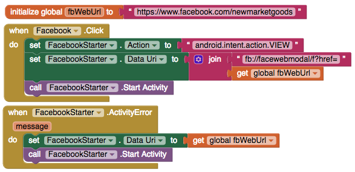

# Activity Starter

### 

To start an application with the Activity Starter, you must supply certain control information to the Android operating system. You do this by setting various properties of Activity Starter before calling the ActivityStarter.StartActivity method.This section gives some examples.

The sample app uses the Activity Starter to open the Facebook and Instagram app if it's installed on a user's device

### Open a deep link to an installed app

The Activity Starter can only open another app if it's installed on a user's device



Send an email from your default app

| Action | android.intent.action.VIEW |
| --- | --- | --- | --- | --- |
| Activity Class |  |
| Activity Package |  |
| Data URI | mailto:{emailAddress} |
| Data URI Example | mailto:hello@thunkable.com |



Open a Facebook page in the app

| Action | android.intent.action.VIEW |
| --- | --- | --- | --- | --- |
| Activity Class |  |
| Activity Package |  |
| Data URI | fb://facewebmodal/f?href={webUrl} |
| Data URI Example | fb://facewebmodal/f?href=[https://www.facebook.com/thunkable](https://www.facebook.com/thunkable) |



Open an Instagram page within the app

| Action | android.intent.action.VIEW |
| --- | --- | --- | --- | --- |
| Activity Class | com.instagram.android.activity.UrlHandlerActivity |
| Activity Package | com.instagram.android |
| Data URI | http://instagram.com/\_u/{instagramHandle} |
| Data URI Example | http://instagram.com/\_u/thunkable |



Open the default Browser app

| Action | android.intent.action.VIEW |
| --- | --- | --- | --- | --- |
| Activity Class |  |
| Activity Package |  |
| Data URI |  |
| Data URI Example | https://thunkable.com |



App made on Thunkable

| Action | com.thunkable.android.{username}.{appname} |
| --- | --- | --- | --- | --- |
| Activity Class | com.thunkable.android.{username}.{appname}.Screen1 |
| Activity Package |  |
| Data URI |  |
| Data URI Example |  |



### Open Facebook deep link in app if app is installed, open in website if not

