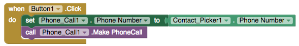

# Phone Call

###  

### Make a phone call

| Property / Event | Description |
| :--- | :--- |
| Phone Number | The number that phone will call when the Make Phone Call method is called. The number is a text string with the specified digits \(e.g., 6505551212\). Dashes, dots, and parentheses may be included \(e.g., \(650\)-555-1212\) but will be ignored; spaces should not be included |
| Make Phone Call | Makes a phone call using the number in the Phone Number property |
| Phone Call Started \(status, phoneNumber\) | Indicates that a phone call has started. If 'status' is 1, incoming call is ringing; if 'status' is 2, outgoing call is dialed |
| Phone Call Ended \(status, phoneNumber\) | Indicates that a phone call has ended. If 'status' is 1, incoming call is missed or rejected; if 'status' is 2, incoming call is answered before hanging up; if 'status' is 3, outgoing call is hung up |
| Incoming Call Answered \(phoneNumber\) | Indicates that an incoming phone call is answered |

