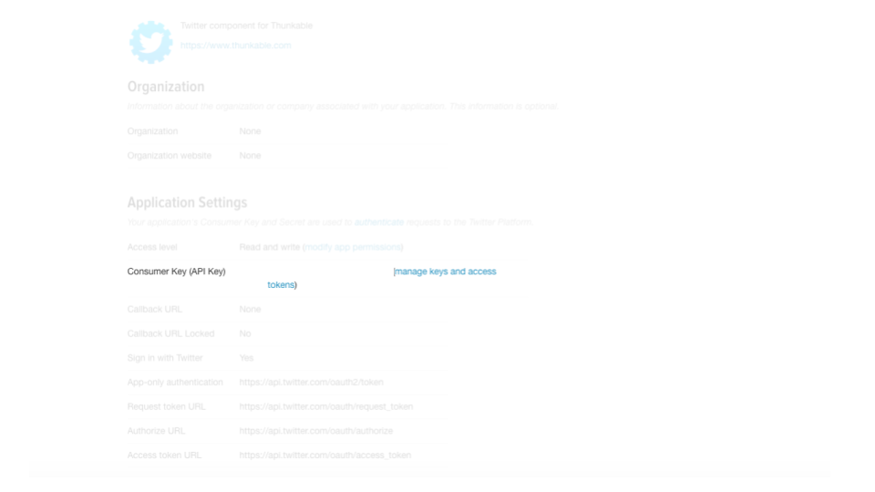
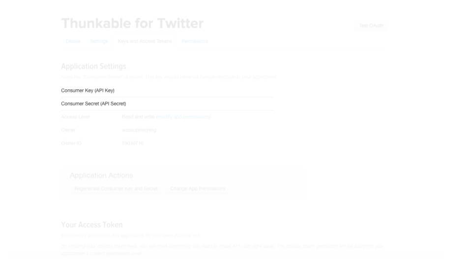

# Twitter

###  

### Authorize app with Twitter

1. First, [go to this link](http://twitter.com/oauth_clients/new) to authorize your app with Twitter 
2. Follow the instructions to obtain the Consumer Key and Consumer Secret from Twitter and add it to the properties for the Twitter component on Thunkable 

| Property | Description |
| :--- | :--- |
| Consumer Key | Encrypted key. Authorizes Twitter via OAuth |
| Consumer Secret | Encrypted key. Authorizes Twitter via OAuth |

### Login to Twitter

| Event | Description |
| :--- | :--- |
| Authorize | Redirects user to login to Twitter via the Web browser using the OAuth protocol if we don't already have authorization |
| Check Authorized | Checks whether we already have access, and if so, causes Is Authorized event handler to be called. |
| IsAuthorized | After the program calls Authorize if the authorization was successful. It is also called after a call to Check Authorized if we already have a valid access token. After this event has been raised, any other method for this component can be called |
| DeAuthorize | Removes Twitter authorization from this running app instance |

### **Tweet**

| Event | Description |
| :--- | :--- |
| Tweet \(status\) | This sends a tweet as the logged-in user with the specified Text, which will be trimmed if it exceeds 160 characters |
| Tweet With Image \(status, imagePath\) | This sends a tweet as the logged-in user with the specified Text and a path to the image to be uploaded, which will be trimmed if it exceeds 160 characters. If an image is not found or invalid, the update will not be sent |

### Direct Message

| Event | Description |
| :--- | :--- |
| Direct Message \(user, message\) | This sends a direct \(private\) message to the specified user. The message will be trimmed if it exceeds 160 characters |
| Request Direct Messages | Requests the 20 most recent direct messages sent to the logged-in user. When the messages have been retrieved, the system will raise the Direct Messages Received event and set the Direct Messages property to the list of messages. |
| DIrect Messages Received \(messages\) | When the recent messages requested through Request Direct Messages have been retrieved. A list of the messages can then be found in the messages parameter or the Messages property |
| Direct Messages | This property contains a list of the most recent messages mentioning the logged-in user. Initially, the list is empty. The value of this property will then be set to the list of direct messages retrieved \(and maintain that value until any subsequent call to Request Direct Messages\) |

### Follow

| Event | Description |
| :--- | :--- |
| Follow \(user\) | Follows a specific user |
| Request Followers | Gets a list of users following the logged-in users |
| Followers Received \(list\) | When all of the followers of the logged-in user requested through Request Followers have been retrieved. A list of the followers can then be found in the followers parameter or the Followers property |
| Followers | A list of the followers of the logged-in user. Initially, the list is empty. The value of this property will then be set to the list of followers \(and maintain its value until any subsequent call to Request Followers\) |
| Stop Following \(user\) | Stops following a user |

### Search Twitter

| Event | Description |
| :--- | :--- |
| Search Twitter \(query\) | Searches Twitter for the given String query |
| Search Successful \(searchResults\) | When the results of the search requested through Search Twitter have been retrieved. A list of the results can then be found in the searchResults property |
| Search Results | This property, which is initially empty, is set to a list of search results after the program. The value of the property will then be the same as the parameter to Search Successful. |

### Request Friend Timeline

| Event | Description |
| :--- | :--- |
| Request Friend Timeline | Gets the most recent 20 messages in the user's timeline |
| Friend Timeline Received | When the messages requested through Request Friend Timeline have been retrieved. The timeline parameter and the Timeline property will contain a list of lists, where each sub-list contains a status update of the form \(username message\) |
| Friend Timeline | This property contains the 20 most recent messages of users being followed. Initially, the list is empty. The value of this property will then be set to the list of messages \(and maintain its value until any subsequent call to Request Friend Timeline |

### Request Mentions

| Event | Description |
| :--- | :--- |
| Request Mentions | Requests the 20 most recent mentions of the logged-in user |
| Mentions Received \(mentions\) | When the mentions of the logged-in user requested through Request Mentions have been retrieved. A list of the mentions can then be found in the mentions parameter or the Mentions property |
| Mentions | A list of mentions of the logged-in user. Initially, the list is empty. The value of this property will then be set to the list of mentions \(and will maintain its value until any subsequent calls to Request Mentions\) |

