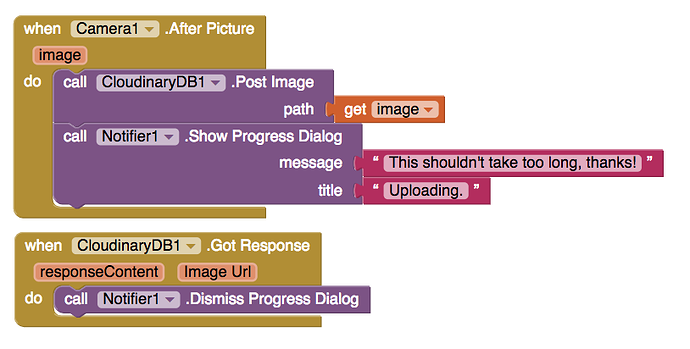
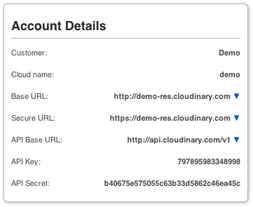

# Cloudinary DB

## 


Thunkable provides its own API key by default for your convenience but if you may want to use your own Cloudinary key to ensure more privacy for your user's images or increase the 10MB image file size limit


## Take a picture, upload it to the Cloudinary cloud and store its url in Firebase

## Set up

No set up is required. Thunkable provides its own subscription key as default. The current image size limit is 10MB.

You may want to create your own free account with [Cloudinary](http://cloudinary.com/) if you want to upload larger images or if you want to ensure better privacy for your user's images.

| Property | Description |
| :--- | :--- |
| Subscription Key | Thunkable provides its own subscription key as DEFAULT. Do not change unless you want to replace it with your own |
| Subscription Secret | Thunkable provides its own API secret as DEFAULT. Do not change unless you want to replace it with your own |
| Cloud Name | Thunkable provides its own Cloud Name as DEFAULT. Do not change unless you want to replace it with your own |

If you do create your own account, the API key corresponds to the 'subscription key', the API secret corresponds to the 'subscription secret' and the cloud name corresponds to the 'cloud name'

## Functionality

| Event | Description |
| :--- | :--- |
| Post Image \(path\) | Uploads the image \(specified by the path\) to the Cloudinary cloud |
| Post Audio \(path\) | Uploads the audio file \(specified by the path\) to the Cloudinary cloud |
| Post Video \(path\) | Uploads the video \(specified by the path\) to the Cloudinary cloud |
| Got Response \(responseContent, imageUrl\) | If okay, returns an imageUrl where the image is hosted. If not okay, will return an explanation for error \(likely because file size exceeds the 10MB limit\). Although it says imageUrl, this is the same url for audio and video files |

