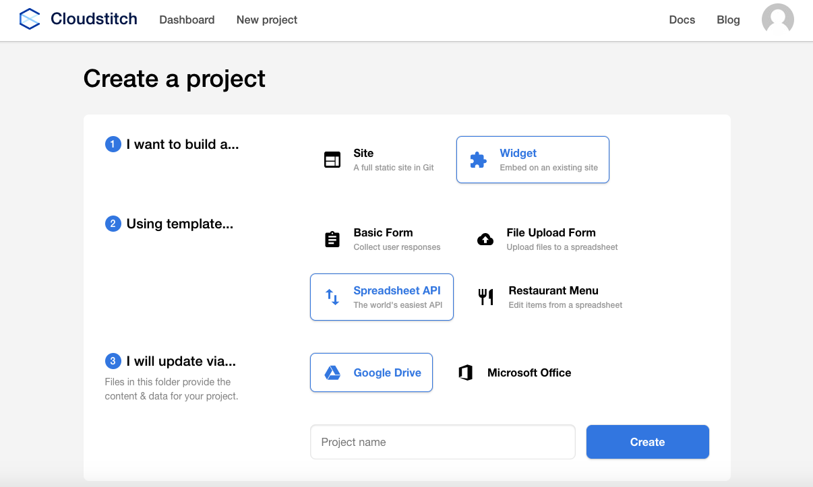
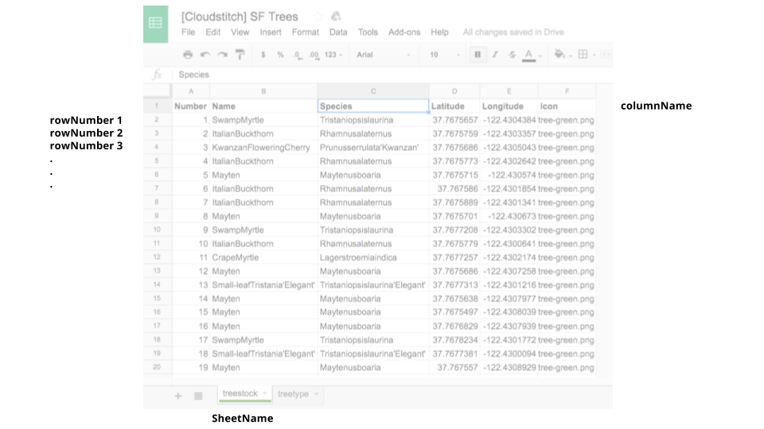
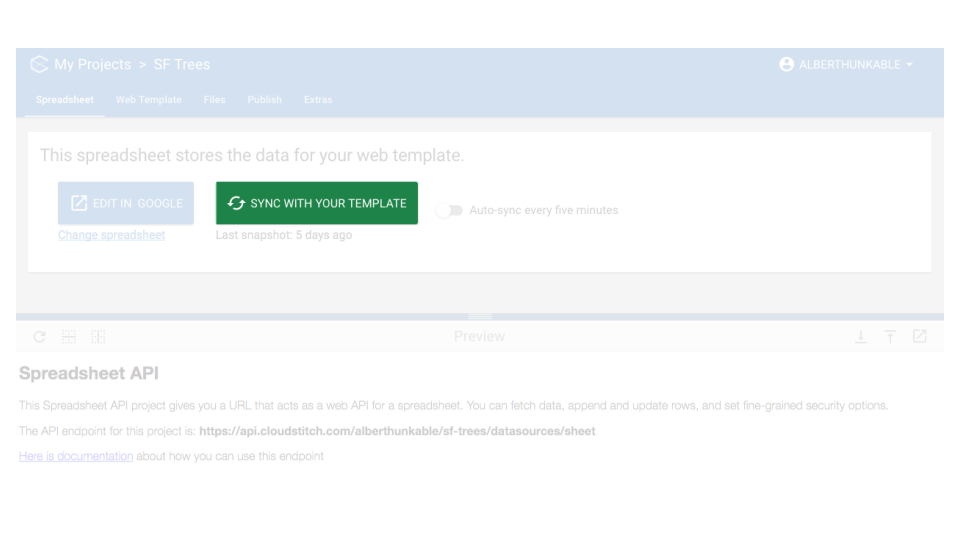
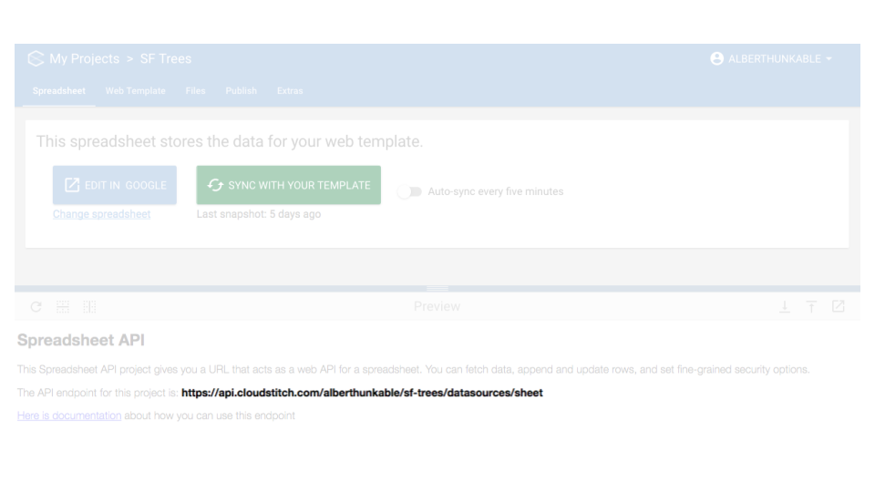
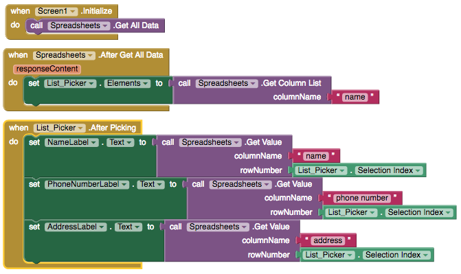
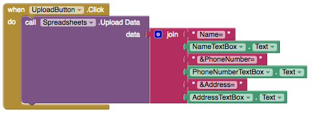

# Spreadsheets

## 

Set up is much easier than Fusion Tables and Spreadsheets can store more rows of data than Firebase or TinyDB, which are both limited to one row of data. The data is also easily visible and manipulated in a Google or Microsoft 360 spreadsheet, which makes like a lot easier.

Spreadsheets is powered by Cloudstitch, a service that makes it easy to connect your Google or Microsoft 360 spreadsheets to your app. Our friends at Cloudstitch have also provided free auto-syncing of data exclusively for Thunkers.

The sample app [First Bus Map of Dhaka](spreadsheets.md) features mapping data stored in a Google spreadsheet

* [Set up](spreadsheets.md#set-up)
* [Get data](spreadsheets.md#get-data)
* [Populate elements in a Listpicker from a Spreadsheet](spreadsheets.md#populate-elements-in-a-listpicker-from-a-spreadsheet)
* [Upload data](spreadsheets.md#upload-data)
* [Troubleshooting](spreadsheets.md#troubleshooting)

## Set up

1. First create an account with [Cloudstitch](https://cloudstitch.com/) and create a new project.
2. Select 'Widget', 'Spreadsheet API' and 'Google Drive'.
3. Add your data to the Spreadsheet with columnNames in the first row. Please do not include spaces in your columnNames or in your Sheet Name. **Important note**: Spreadsheets does not currently work if your cells contain a “,” or “:” in the cells that are being retrieved.  More info on the [current workaround here](https://community.thunkable.com/t/handling-and-in-cloudstitch-data/1879) from Domnhall in our community

1. Make sure to hit 'Sync to Template' every time you refresh your data. Your app is likely to crash if you do not follow this step
2. Go to Thunkable and add the API Endpoint that you see in Cloudstitch BUT remember to exclude `/datasources/sheet` and include `dev?=true` to the end of the given url. For example, if the Cloudstitch API endpoint is `https://api.cloudstitch.com/alberthunkable/sf-trees/datasources/sheet`, the API endpoint you want to enter into Thunkable is `https://api.cloudstitch.com/alberthunkable/sf-trees?dev=true`
3. Add the Sheet Name.  You're all set!

| Property | Description |
| :--- | :--- |
| API Endpoint | Unique url for each spreadsheet created in Cloudstitch. The url is called the API endpoint on Cloudstitch but excludes the '/datasources/sheet' at the end of the endpoint. If you plan to upload data to your spreadsheet, enable auto-sync by adding '?dev=true' to the end of your API endpoint |
| Sheet Name | Name of the sheet in the Spreadsheet |

## Populate elements in a Listpicker from a Spreadsheet

## Get data

| Event | Description |
| :--- | :--- |
| Get All Data | Retrieves all data from the Spreadsheet via the Cloudstitch service |
| After Get All Data \(responseContent\) | Event triggered after data is retrieved from Spreadsheet. If OK, the 'responseContent' will be the data retrieved from the Google Spreadsheet |
| Get Column List \(columnName\) | Retrieves all data in a column as a list; user must designate column name \(not case sensitive but better without spaces\) |
| Get Row List \(rowNumber\) | Retrieves all data in a row as a list; user must designate row number as an integer and row 1 starts in row 2 since the first row of data is ignored |
| Get Value \(columnName, rowNumber\) | Retrieves a single value based on column name and row number pair |

## Populate elements in a Listpicker from a Spreadsheet

## Upload data

| Event | Description |
| :--- | :--- |
| Upload Data \(data\) | Uploads data to Spreadsheet. Data must be in the format “'columnName1'=’value1’&'columnName2'=’value2’\). See above for an example |
| After Upload \(responseContent\) | Event triggered after data is uploaded from Spreadsheet. If OK, the 'responseContent' will return OK |

## Troubleshooting

If your app is crashing, then most likely:

* You have not hit 'Sync to Template' every time you refresh your data on the Cloudstitch interface \(see step 3 of [Set up](spreadsheets.md#set-up)\)
* Spreadsheets does not currently work if your cells contain a “,” or “:” in the cells that are being retrieved. More info on the [current workaround here from Domhnall](https://community.thunkable.com/t/handling-and-in-cloudstitch-data/1879?u=domhnall) in our community if you do have them

