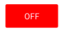
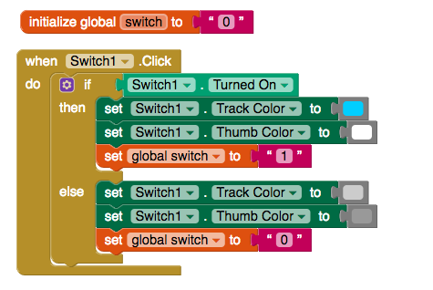
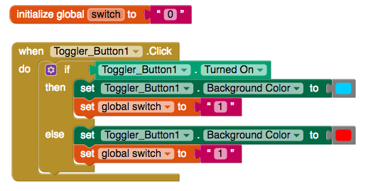

# Switch + Toggle

####  +  

Toggles and switches are useful buttons for switching a user between two settings or states.

|  | "On" | "Off" |
| :--- | :--- | :--- |
| [Switch](switch-+-toggle.md#switch-settings) |  |  |
| [Toggle](switch-+-toggle.md#toggle-settings) |  |  |

### Switch  

#### Setting Up Switch to Change Appearance and Variable Setting When Set On and Off

#### Basic Set-Up

| Property | Description |
| :--- | :--- |
| Turned On | Default \(Off\). If checked, toggle will be set to "on" |
| Thumb Color | Default \(Gray\). Color of the switch dial. You can choose any color on the Designer palette or customize the color to any RGB value in the Blocks editor |
| Track Color | Default \(Gray\). Color of the switch track. You can choose any color on the Designer palette or customize the color to any RGB value in the Blocks editor |
| Click | User taps and releases the switch |

#### Advanced Settings

| Property / Event | Description |
| :--- | :--- |
| Shape | The shape of the button outline. Default \(rectangle\), rounded, rectangular or oval.  The shape will not be visible if an Image is being displayed |
| Background Color | The background color of the button outline. Default \(none\). You can choose any color on the Designer palette or customize the color to any RGB value in the Blocks editor |
| Image | Not recommended. You can upload an image to your app or reference an image url. If an image is uploaded, it will negate the background color and shape properties |
| Text | Text that appears to the left of the switch |
| Text Color | Default \(White\). You can choose any color on the Designer palette or customize the color to any RGB value in the Blocks editor |
| Text Alignment | Left, center \(default\) or right |
| Font Bold | If checked, text is displayed in **bold** |
| Font Italic | If checked, text is displayed in _italic_ |
| Font Size | Point size for switch text |
| Font Typeface | Default \(Roboto\), Roboto Regular, Roboto Thin, Sans Serif, Serif, and Monospace. You can upload your own custom font \(.ttf\) |
| Show Feedback | If checked, shows visual feedback when the switch is pressed |
| Visible | If checked, the switch will be visible on the screen |
| Long Click | User holds the switch down |
| Touch Down | User gently presses the switch |
| Touch Up | User releases the switch |
| Enabled | If checked, switch is enabled |
| Got Focus | User's finger is over the switch, making it possible to click |
| Lost Focus | User's finger is away from the switch, making it no longer possible to click |

### Toggle  

#### Setting Up Toggle to Change Appearance and Variable Setting When Set On and Off

#### Basic Set-Up

| Property | Description |
| :--- | :--- |
| Turned On | Default \(Off\). If checked, toggle will be set to "on" |
| Text On | Text that will be displayed on toggle when set to "on" |
| Text Off | Text that will be displayed on toggle when set to "off" |
| Text Color | Default \(Black\). You can choose any color on the Designer palette or customize the color to any RGB value in the Blocks edito |
| Background Color | The background color of the toggle. Default \(Gray\). You can choose any color on the Designer palette or customize the color to any RGB value in the Blocks editor |
| Click | User taps and releases the toggle |

#### Advanced Settings

| Property / Event | Description |
| :--- | :--- |
| Shape | The shape of the toggle button. Default \(rectangle\), rounded, rectangular or oval.  The shape will not be visible if an Image is being displayed |
| Image | Not recommended. You can upload an image to your app or reference an image url. If an image is uploaded, it will negate the background color and shape properties |
| Text Alignment | Left, center \(default\) or right |
| Font Bold | If checked, text is displayed in **bold** |
| Font Italic | If checked, text is displayed in _italic_ |
| Font Size | Point size for switch text |
| Font Typeface | Default \(Roboto\), Roboto Regular, Roboto Thin, Sans Serif, Serif, and Monospace. You can upload your own custom font \(.ttf\) |
| Show Feedback | If checked, shows visual feedback when the toggle is pressed |
| Visible | If checked, the toggle will be visible on the screen |
| Long Click | User holds the toggle down |
| Touch Down | User gently presses the toggle |
| Touch Up | User releases the toggle |
| Enabled | If checked, toggle is enabled |
| Got Focus | User's finger is over the toggle, making it possible to click |
| Lost Focus | User's finger is away from the toggle, making it no longer possible to click |

