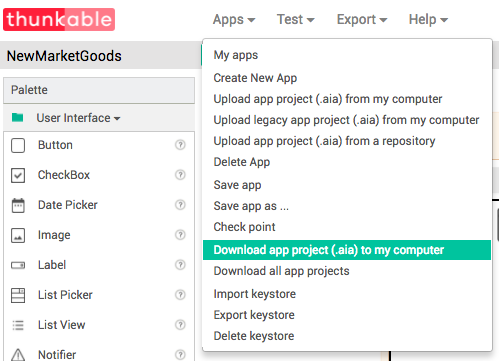
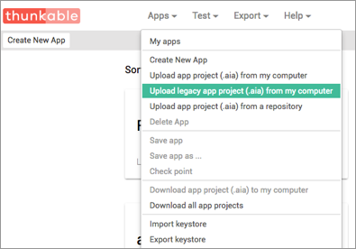
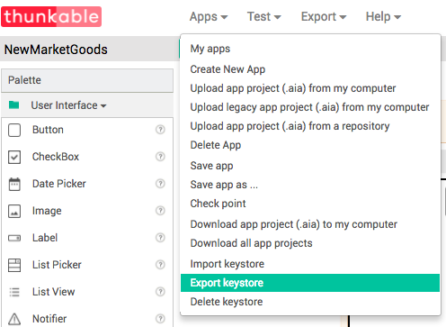
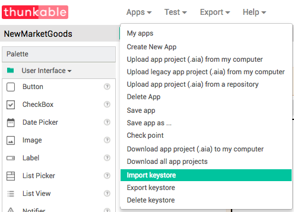
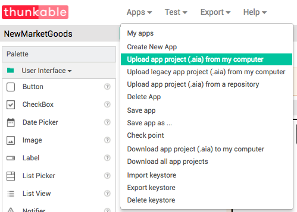

# Migrate from Beta


Thunkable has graduated all its beta features to the Thunkable for Android platform. As a result, the Thunkable beta platform \([beta.thunkable.com](https://beta.thunkable.com)\) is in read-only mode on April 30, 2018 and will be shut down on May 31, 2018. We kindly ask you to please move over all your project\(s\) before then. 


| Importing an unpublished app project | Importing an app published on the Google Play store | If you have apps published on the Google Play store made from both the Thunkable for Android platform AND from Beta |
| :--- | :--- | :--- |
| [Quick and easy](migrate-from-beta.md#quick-import) | [Follow these steps](migrate-from-beta.md#publish-import) | \*\*[Please read this](migrate-from-beta.md#migrate-both)\*\* |

## Importing an unpublished app project

### Download app project file \(.aia\) from Thunkable for Android \(Beta\)

* Sign into [Thunkable for Android Beta](https://beta.thunkable.com)
* Select the project you would like to download 

The code for the app is now downloaded to your computer. It is a file that is titled &lt;your\_app\_name&gt;.aia.

**IMPORTANT: If you have a project with the same name in the main platform, you will have to rename the app project \(.aia\) file to import it to the platform**

### Upload app project file \(.aia\) to Thunkable for Android \(Main Platform\)

* Sign into [Thunkable for Android](https://app.thunkable.com)

Select the project that you previously downloaded

## Importing an app published on the Google Play Store

### Download app project file \(.aia\) from Thunkable for Android \(Beta\)

* Sign into [Thunkable for Android Beta](https://beta.thunkable.com)
* Select the project you would like to download 

The code for the app is now downloaded to your computer. It is a file that is titled &lt;your\_app\_name&gt;.aia.

**IMPORTANT: If you have a project with the same name in the main platform, you will have to rename the app project \(.aia\) file to import it to the platform**

### Export your keystore from Thunkable for Android \(Beta\) {#exporting-your-keystore-from-mit-app-inventor}

### Upload app project file \(.aia\) to Thunkable for Android \(Main Platform\)

* Sign into [Thunkable for Android](https://app.thunkable.com)

### Import your keystore to Thunkable for Android \(Main Platform\) {#exporting-your-keystore-from-mit-app-inventor}

### When you are ready to publish/update your app on the Google Play Store, download app \(.apk\) to your computer

Package the app \(.apk file\) by going to the "Export" menu on the Thunkable toolbar

Select "App \(save .apk to my computer\)." A pop-up box \(seen below\) should alert you that your download has begun. Note: The other option \(provide QR code for .apk\) produces a scannable QR code that will download the app for two hours. You can share this code with others, but they have to use it within 2 hours of your generating it.

You can also download the apk directly from your apps home page by clicking on the download arrow next to any app project.

### Publish your app to the Google Play Store {#exporting-your-keystore-from-mit-app-inventor}

You can now go to [Google Play Publishing Home](https://play.google.com/apps/publish/signup/) and follow the steps to publish your app to Google Play. Make sure to edit your app version number.

For more details, you may want to start with [Introduction to Publishing on Google Play](https://developer.android.com/distribute/tools/launch-checklist.html) and [Google Support on Uploading to Google Play](https://support.google.com/googleplay/android-developer/answer/113469?hl=en&topic=2365624&ctx=topic).

## If you have apps published on the Google Play Store made from both the Thunkable for Android platform AND from Beta

WARNING: You can only have one unique keystore per account. If you import your keystore from Beta to the main Thunkable for Android platform, it will override that keystore. We highly recommend that you first download your keystore from both platforms and save it in a safe place. When you are ready to publish an app that was made on Thunkable beta, then upload the beta keystore. When you want to publish an app made on the Thunkable for Android main platform, then upload that corresponding keystore.

### Export your keystore from Thunkable for Android \(app.thunkable.com\). Save it in a safe place.

* Sign into [Thunkable for Android](https://app.thunkable.com)

### Export your keystore from Thunkable for Android Beta \(beta.thunkable.com\). Save it in a safe place.

* Sign into [Thunkable for Android Beta](https://beta.thunkable.com)

### Download app project file \(.aia\) from Thunkable for Android \(Beta\)

* Select the project you would like to download 

The code for the app is now downloaded to your computer. It is a file that is titled &lt;your\_app\_name&gt;.aia.


If you have a project with the same name in the main platform, you will have to rename the app project \(.aia\) file to import it to the platform


### Upload app project file \(.aia\) to Thunkable for Android \(Main Platform\)

* Sign into [Thunkable for Android](https://app.thunkable.com)

### When you are ready to publish/update your app to the Google Play Store, import the corresponding keystore to which platform the app was made on e.g. if it was originally published from beta, import that keystore

* Sign into [Thunkable for Android](https://app.thunkable.com)

### Step 6. Download app \(.apk\) to your computer

Package the app \(.apk file\) by going to the "Export" menu on the Thunkable toolbar

Select "App \(save .apk to my computer\)." A pop-up box \(seen below\) should alert you that your download has begun. Note: The other option \(provide QR code for .apk\) produces a scannable QR code that will download the app for two hours. You can share this code with others, but they have to use it within 2 hours of your generating it.

You can also download the apk directly from your apps home page by clicking on the download arrow next to any app project.

### Publish your app to the Google Play Store {#exporting-your-keystore-from-mit-app-inventor}

You can now go to [Google Play Publishing Home](https://play.google.com/apps/publish/signup/) and follow the steps to publish your app to Google Play. Make sure to edit your app version number.

For more details, you may want to start with [Introduction to Publishing on Google Play](https://developer.android.com/distribute/tools/launch-checklist.html) and [Google Support on Uploading to Google Play](https://support.google.com/googleplay/android-developer/answer/113469?hl=en&topic=2365624&ctx=topic).

